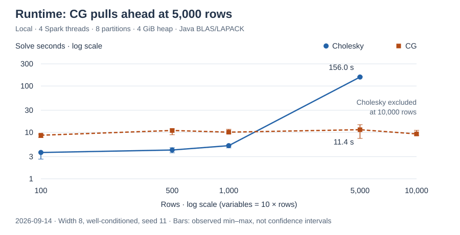
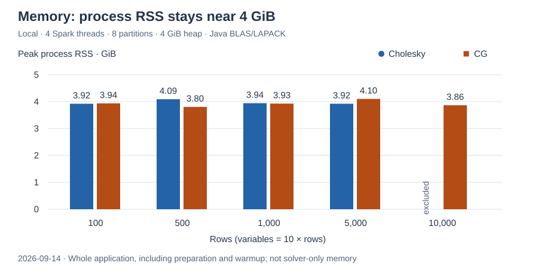

# spark-lp


[](LICENSE)

Linear, mixed-integer linear, and continuous convex quadratic programming over
Apache Spark. It provides a sparse modeling compiler, a predictor-corrector interior-point solver ([Mehrotra][mehrotra]), and
[branch-and-bound][landdoig] for integer variables.

The DSL uses syntax very similar to [PuLP][pulp].

## Features

- **LP & MILP** — [interior-point solving][mehrotra], feasibility/rowless models, continuous/integer/binary domains.
- **Convex QP** — [separable quadratics][gondzio], coupled PSD factors, weighted least squares.
- **MIP search** — [branch-and-bound][landdoig], SOS1/SOS2, cover cuts, strong branching, parallel nodes.
- **Scala & Spark DSL** — DataFrames, typed Datasets, grouped constraints, dot products, combinatorics.
- **Editable models** — coefficient/RHS/bound updates, fixing, renaming, copies, prioritized objectives.
- **Sparse compilation & presolve** — distributed coefficients, propagation, substitution, original-coordinate reconstruction.
- **Matrix-free solving** — [regularized CG, adaptive preconditioning][gondzio], automatic Cholesky/CG selection, warm starts.
- **Runtime controls** — progress callbacks, deadlines, cancellation, stagnation detection, MIP gaps.
- **Solution analysis & interchange** — slack, residuals, dual prices, reduced costs; LP/MPS/JSON import/export.
- **Solver extensions** — custom adapters, optional HiGHS native sessions, infeasibility/unbounded certificates.

## Usage

Requires **JDK 11** and **Scala 2.12**; Spark is provided by your application.
Artifacts are published for seven Spark variants (**2.4.8, 3.0.2, 3.1.3, 3.2.4,
3.3.2, 3.4.2, 3.5.3**), each versioned `<spark-version>_<library-version>`.

Add the coordinate matching your Spark runtime — for example Spark 3.5.3 with
library 2.1.0:

```scala
libraryDependencies += "com.github.vbmacher" %% "spark-lp" % "3.5.3_2.1.0"
```

Native BLAS/LAPACK can accelerate CPU linear algebra; a Java fallback is available.

## Build and publish

Each Spark variant is a separate sbt module named
`spark-lpSpark_<major>_<minor>2_12` (Scala 2.12) — e.g. `spark-lpSpark_3_52_12`
for Spark 3.5. The library version is `productVersion` in `build.sbt`.

Publish one variant to the local Ivy repository, then depend on it as above:

```sh
sbt 'spark-lpSpark_3_52_12/publishLocal'
```

Publish every variant locally (the root project aggregates all modules):

```sh
sbt publishLocal
```

Publish to Maven Central (needs Sonatype credentials in `~/.sbt/sonatype.sbt`
and a PGP signing key):

```sh
sbt publishSigned sonatypeBundleRelease
```

## Linear programming example

Minimize `2*x + y` subject to `x + y >= 10`, with nonnegative variables:

```scala
import com.github.vbmacher.spark_lp.dsl._
import com.github.vbmacher.spark_lp.dsl.implicits._
import org.apache.spark.sql.SparkSession

implicit val spark: SparkSession = SparkSession.builder()
  .master("local[2]").appName("spark-lp-example").getOrCreate()
import spark.implicits._

try {
  val costs = Seq(("x", 2.0), ("y", 1.0)).toDF("id", "cost")
  val model = LpProblem("minimum cost", Minimize)
  val amount = model.variables("amount", costs, key = $"id")
  model += lpSum(amount * $"cost")
  model += (lpSum(amount) >= 10.0).named("demand")

  val result = model.solve()
  try {
    if (result.status == LpStatus.Optimal) {
      println(result.objectiveValue) // approximately 10.0
      result.values(amount).orderBy("id").show(truncate = false)
      // x is approximately 0.0; y is approximately 10.0
    }
  } finally result.close()
} finally spark.stop()
```

For Spark data, declare `model.variables("amount", domain, col("id"))` and build
objectives with `amount.sum(col("cost"))`. Typed datasets use `variablesOf` and
`weightedBy`; `sumBy` and `lpSumBy` create grouped constraints.

## Quadratic objectives

Existing typed data can also supply distributed quadratic and linear coefficients:

```scala
import com.github.vbmacher.spark_lp.dsl._
import com.github.vbmacher.spark_lp.dsl.implicits._

final case class QuadraticTerm(id: String, curvature: Double, linear: Double)

import spark.implicits._
val terms = Seq(
  QuadraticTerm("a", curvature = 2.0, linear = -4.0),
  QuadraticTerm("b", curvature = 4.0, linear = -12.0)
).toDS()

val model = LpProblem("weighted fit")
val value = model.variablesOf("value", terms, (term: QuadraticTerm) => term.id)
model += QpObjective.separable(
  value.weightedBy(terms)(_.curvature),
  value.weightedBy(terms)(_.linear))

val result = model.solve()
try {
  result.values(value).orderBy("id").show(truncate = false)
  // a is approximately 2.0; b is approximately 3.0
} finally result.close()
```

`QpObjective.separable(diagonal, linear)` expresses `0.5 * sum(q_i*x_i^2) + c^T*x + k`.
For sparse cross-variable terms, use `QpObjective.squared(...)` factors; factor
weights guarantee convexity structurally, and negating a convex objective yields
concave maximization. The [QP guide](docs/algorithm.adoc#_convex_quadratic_objectives) covers
representations, backend requirements and numerical checks.

## Limits

- QP supports **continuous variables and linear constraints** only; mixed-integer QP,
  nonconvex objectives and quadratic constraints are unsupported. Coupled Hessians are
  supplied as **PSD factors**, not arbitrary matrix entries.
- `Auto` normally uses Cholesky through ~10,000 equality-form rows (subject to
  `maxLocalConstraints`); it stores its normal matrix on the driver. CG avoids that
  matrix. This crossover is a heuristic, not universal.
- Integer search can grow exponentially; cuts, probing and parallelism can increase
  time and memory. Tolerances and node limits do not guarantee a solution for every model.
- The optional HiGHS bridge runs a bounded local Python process; it is not a
  distributed solver.
- **Production GPU acceleration is not included.**

## Documentation and validation

- [Usage, installation and API vocabulary](docs/usage.adoc)
- [Algorithm, backend selection, scaling and certificate verification](docs/algorithm.adoc)
- [Runnable examples](examples/src/main/scala/com/github/vbmacher/spark_lp/examples/)

Run the supported Spark matrix with `sbt +test`, or Spark 3.5 only:

```sh
sbt 'spark-lpSpark_3_52_12/test' 'examplesSpark_3_5/compile'
```

## Benchmarks

Local sparse LPs (2026-09-14): Cholesky wins through 1,000 rows; at 5,000,
CG is **13.6× faster** (11.4 vs 156.0 seconds). Both stay near 4 GiB process RSS.
These are matched workloads, not a universal crossover; ranges show observed
variation, not confidence intervals. Cholesky at 10,000 rows was resource-excluded.

[](https://bencher.dev/perf/spark-lp)
[](https://bencher.dev/perf/spark-lp)

[Bencher dashboard](https://bencher.dev/perf/spark-lp): runtime, memory and convergence
history, including separate EMR comparisons. Run a small suite locally:

```sh
./benchmarks/bench run --suite smoke --output benchmarks/output/smoke.bmf.json
```

[Run or extend suites](benchmarks/README.md) · [Methodology and metrics](docs/benchmarks.adoc).

## Research references

- **Predictor-corrector method:** Mehrotra (1992), [On the Implementation of a Primal-Dual Interior Point Method][mehrotra].
- **LP Newton equations:** Cui, Morikuni, Tsuchiya and Hayami (2019), [Interior-point methods for LP based on Krylov subspace iterative solvers][cui], §2.1.
- **Matrix-free regularization, preconditioning and QP equations:** Gondzio (2010), [Matrix-Free Interior Point Method][gondzio], §§2–6.
- **Integer optimization and cover cuts:** Nemhauser and Wolsey, [Integer and Combinatorial Optimization][integer], and [Knapsack Cover Inequalities][covers].
- **Branch-and-bound:** Land and Doig (1960), [An Automatic Method of Solving Discrete Programming Problems][landdoig].
- **Presolve:** [PaPILO: A Parallel Presolving Library for Integer and Linear Programming with Multiprecision Support][papilo].
- **Strong branching:** [SCIP full strong branching documentation][strong].

The [algorithm guide](docs/algorithm.adoc) describes how these methods are adapted
in spark-lp. Project attribution: [Ehsan M. Kermani's spark-lp](https://github.com/ehsanmok/spark-lp)
and his thesis, [Distributed linear programming with Apache Spark](https://open.library.ubc.ca/cIRcle/collections/ubctheses/24/items/1.0340337).

[mehrotra]: https://epubs.siam.org/doi/10.1137/0802028
[cui]: https://link.springer.com/article/10.1007/s10589-019-00103-y
[gondzio]: https://webhomes.maths.ed.ac.uk/~jgondzio/reports/mtxFree.pdf
[integer]: https://onlinelibrary.wiley.com/doi/book/10.1002/9781118627372
[covers]: https://onlinelibrary.wiley.com/doi/abs/10.1002/9780470400531.eorms0204
[landdoig]: https://doi.org/10.2307/1910129
[papilo]: https://arxiv.org/abs/2206.10709
[strong]: https://scipopt.org/doc/html/branch__fullstrong_8c.php
[pulp]: https://coin-or.github.io/pulp/
