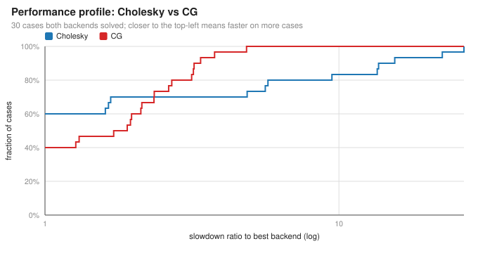
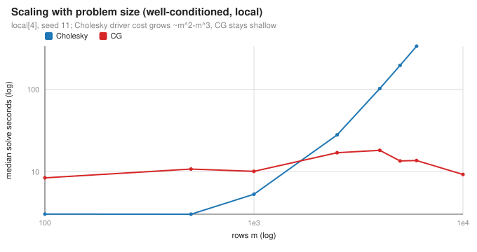
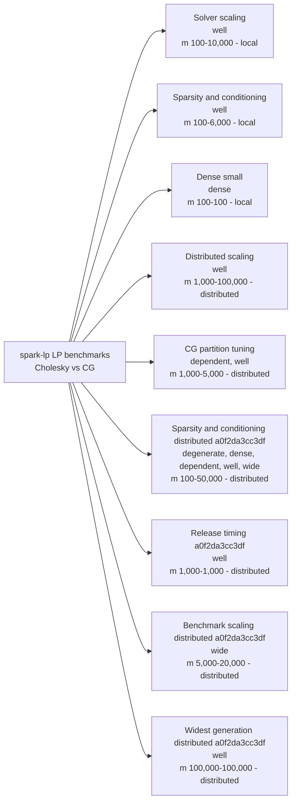
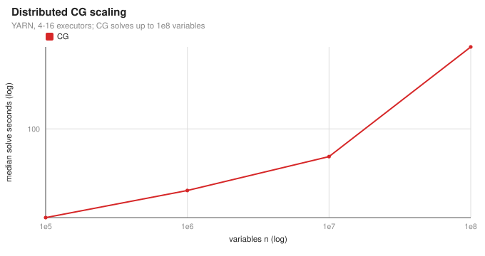
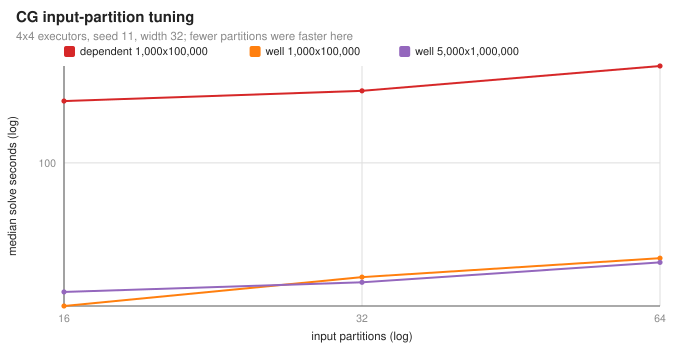
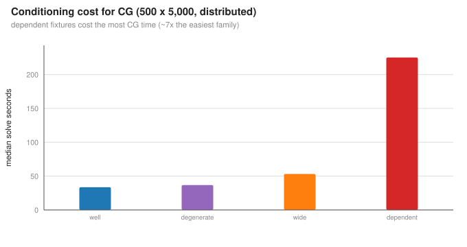

# Benchmarks

Cholesky (direct) vs CG (matrix-free) linear-program solvers on Apache Spark. Captured evidence: 41 campaigns, 1571 measured slots and 315 warmup records. Warmups are excluded from solve statistics and failed runs never contribute timing; missing records are not inferred.

## At a glance

Two backends are compared on every case: **Cholesky** (direct normal-equations solve) and **CG** (matrix-free conjugate gradient). Pick a backend with the table, skim the charts, then open a section for the full measurements. For hands-on exploration use the [interactive dashboard](index.html).

### Which backend should I use?

| If your problem is... | Prefer | Why |
|---|---|---|
| Small (<= ~1,000 rows), dense, or badly conditioned (dependent/degenerate) | **Cholesky** | faster and more reliable there |
| Well-conditioned and sparse from ~2,500 rows up | **CG** | direct factor cost grows with m^2-m^3 |
| Too large for the driver memory gate | **CG** | avoids the O(m^2) driver matrix |
| Numerically hard at scale (wide/near-dependent, tight tolerance) | **validate** | both backends can fail; require residual checks |

*Read it as: for a slowdown budget on the x-axis, what fraction of cases each backend solves within that factor of the best. Curves that reach the top-left first win more often.*

*Median solve time as rows grow (log-log). Cholesky steepens; CG stays flatter.*

### What was tested

Coverage: 41 campaigns, 167 distinct cases, families degenerate, dense, dependent, well, wide; rows m 100-100,000, variables n up to 100,000,000. Every solve is independently re-validated (primal/dual/gap/objective); timing never includes a failed run.

## Environment

| ID | Computer | OS | Spark version | Java version | Spark master |
|---|---|---|---|---|---|
| ENV-01 | fedora | Linux | 3.5.3 | 11.0.26+4-LTS | local[4] |
| ENV-02 | unrecorded | unrecorded | unrecorded | unrecorded | unrecorded |
| ENV-03 | unrecorded host; Sandbox blocked local socket creation before any solver ran | unrecorded | unrecorded | unrecorded | unrecorded |
| ENV-04 | fedora; Shared host with concurrent JVM workloads; timings are not an isolated performance comparison | Linux | 3.5.3 | 11.0.26+4-LTS | local[4] |
| ENV-05 | distributed cluster | Linux | 3.5.3 | 11.0.32+9-LTS | yarn |
| ENV-06 | distributed cluster | Linux | 3.5.3 | 11.0.32.1+10-LTS | yarn |

## Results

All runs use the `CholeskyBenchmark` / `CGBenchmark` instances in [Benchmark.scala](../src/main/scala/com/github/vbmacher/spark_lp/Benchmark.scala); each row pairs the two backends on one case. Memory payloads are computed estimates; RSS is sampled. Timing scope is core solve excluding independent validation; the tolerance is recorded per case; no CG restarts or rank escalations were recorded.

### Solver scaling

measures scaling with rows, variables and sparse support.

- From ~2,500 rows CG was ~8x faster than Cholesky here.
- Cholesky driver work scales with m^2-m^3; CG scales with iterations, not m directly.
- For small or dense cases Cholesky is competitive and often more reliable.

Full measurements (8 cases) &mdash; data: [solver-scaling--local-4-50e650f881f7.bmf.json](../src/results/data/solver-scaling--local-4-50e650f881f7.bmf.json)

Shared values: **Fixture family:** well; **Seed:** 11; **Partitions:** 8; **Heap (GiB):** 4; **Executor topology:** 1×4; **Environment:** ENV-01.

| ID | Case | Rows m | Variables n | Nonzeros | Density (%) | Nonzeros / row | Warmup outcomes | Cholesky solve s; valid; iterations | Cholesky max primal/dual/gap | Cholesky memory | CG solve s; valid; iterations | CG max primal/dual/gap | CG memory |
|---|---|---|---|---|---|---|---|---|---|---|---|---|---|
| SS-01 | rows-100-vars-1000-width-8 | 100 | 1,000 | 800 | 0.8 | 8 | Success ×2 | 3.691 [2.660–3.749]; 5/5 valid; outer 6 | 2.38e-16/2.97e-12/3.59e-10 | exec O(nnz+n+m²) [≈0.42 MiB](../README.md#memory); driver O(m²) ≈0.16 MiB; RSS combined 4,015.20 MiB | 8.688 [7.699–9.128]; 5/5 valid; outer 6, CG 106 | 1.54e-16/2.97e-12/3.59e-10 | exec O(nnz+n+m) [≈0.12 MiB](../README.md#memory); driver O(m+m·rank) ≈0.006 MiB; RSS combined 4,029.59 MiB |
| SS-02 | rows-500-vars-5000-width-8 | 500 | 5,000 | 4,000 | 0.16 | 8 | Success ×2 | 4.174 [3.636–4.682]; 5/5 valid; outer 7 | 1.65e-16/3.35e-17/9.84e-11 | exec O(nnz+n+m²) [≈8.20 MiB](../README.md#memory); driver O(m²) ≈3.85 MiB; RSS combined 4,187.84 MiB | 10.998 [8.900–11.869]; 5/5 valid; outer 7, CG 128 | 6.84e-11/3.69e-17/6.4e-12 | exec O(nnz+n+m) [≈0.60 MiB](../README.md#memory); driver O(m+m·rank) ≈0.03 MiB; RSS combined 3,895.88 MiB |
| SS-03 | rows-1000-vars-10000-width-64 | 1,000 | 10,000 | 64,000 | 0.64 | 64 | Success ×2 | 6.399 [6.352–6.869]; 5/5 valid; outer 10 | 2.13e-16/7.03e-16/9.49e-11 | exec O(nnz+n+m²) [≈32.30 MiB](../README.md#memory); driver O(m²) ≈15.32 MiB; RSS combined 4,031.66 MiB | 24.162 [16.534–28.760]; 5/5 valid; outer 10, CG 528 | 1.38e-10/7.07e-16/2.7e-10 | exec O(nnz+n+m) [≈1.85 MiB](../README.md#memory); driver O(m+m·rank) ≈0.06 MiB; RSS combined 4,136.53 MiB |
| SS-04 | rows-1000-vars-10000-width-8 | 1,000 | 10,000 | 8,000 | 0.08 | 8 | Success ×2 | 5.180 [4.649–5.320]; 5/5 valid; outer 7 | 1.61e-16/3.33e-17/9.27e-11 | exec O(nnz+n+m²) [≈31.66 MiB](../README.md#memory); driver O(m²) ≈15.32 MiB; RSS combined 4,036.34 MiB | 10.120 [9.401–11.665]; 5/5 valid; outer 7, CG 125 | 1.33e-11/3.34e-17/6.82e-11 | exec O(nnz+n+m) [≈1.21 MiB](../README.md#memory); driver O(m+m·rank) ≈0.06 MiB; RSS combined 4,020.98 MiB |
| SS-05 | rows-1000-vars-100000-width-8 | 1,000 | 100,000 | 8,000 | 0.008 | 8 | Success ×2 | 4.325 [3.986–6.107]; 5/5 valid; outer 6 | 5.39e-16/1.47e-12/1.9e-09 | exec O(nnz+n+m²) [≈40.59 MiB](../README.md#memory); driver O(m²) ≈15.32 MiB; RSS combined 4,651.27 MiB | 5.652 [5.459–5.964]; 5/5 valid; outer 6, CG 80 | 1.1e-10/1.47e-12/2.1e-09 | exec O(nnz+n+m) [≈10.13 MiB](../README.md#memory); driver O(m+m·rank) ≈0.06 MiB; RSS combined 4,308.09 MiB |
| SS-06 | rows-1000-vars-1000000-width-8 | 1,000 | 1,000,000 | 8,000 | 0.0008 | 8 | Success ×2 | 6.278 [6.083–6.460]; 5/5 valid; outer 6 | 8.85e-16/7.58e-14/5.5e-11 | exec O(nnz+n+m²) [≈129.85 MiB](../README.md#memory); driver O(m²) ≈15.32 MiB; RSS combined 5,015.53 MiB | 7.991 [7.591–8.431]; 5/5 valid; outer 6, CG 50 | 1.37e-13/7.58e-14/5.52e-11 | exec O(nnz+n+m) [≈99.40 MiB](../README.md#memory); driver O(m+m·rank) ≈0.06 MiB; RSS combined 5,033.89 MiB |
| SS-07 | rows-5000-vars-50000-width-8 | 5,000 | 50,000 | 40,000 | 0.016 | 8 | Success ×2 | 156.043 [155.636–161.278]; 5/5 valid; outer 7 | 2.11e-16/3.51e-17/2.34e-09 | exec O(nnz+n+m²) [≈768.66 MiB](../README.md#memory); driver O(m²) ≈381.77 MiB; RSS combined 4,015.58 MiB | 11.436 [7.417–14.664]; 5/5 valid; outer 7, CG 149 | 4.99e-16/1.22e-16/2.34e-09 | exec O(nnz+n+m) [≈6.03 MiB](../README.md#memory); driver O(m+m·rank) ≈0.31 MiB; RSS combined 4,199.03 MiB |
| SS-08 | rows-10000-vars-100000-width-8 | 10,000 | 100,000 | 80,000 | 0.008 | 8 | Success ×1 | — | — | — | 9.272 [8.534–11.076]; 5/5 valid; outer 8, CG 162 | 2.37e-12/3.54e-17/9.21e-11 | exec O(nnz+n+m) [≈12.05 MiB](../README.md#memory); driver O(m+m·rank) ≈0.61 MiB; RSS combined 3,957.58 MiB |

### Sparsity and conditioning

tests density, row scaling and near dependence.

- From ~2,500 rows CG was ~8x faster than Cholesky here.
- Cholesky driver work scales with m^2-m^3; CG scales with iterations, not m directly.
- For small or dense cases Cholesky is competitive and often more reliable.

Full measurements (20 cases) &mdash; data: [sparsity-and-conditioning--local-4-50e650f881f7.bmf.json](../src/results/data/sparsity-and-conditioning--local-4-50e650f881f7.bmf.json)

Shared values: **Nonzeros / row:** 20; **Fixture family:** well; **Partitions:** 8; **Heap (GiB):** 4; **Executor topology:** 1×4; **Environment:** ENV-01; **Warmup outcomes:** Success ×2.

| ID | Case | Rows m | Variables n | Nonzeros | Density (%) | Seed | Cholesky solve s; valid; iterations | Cholesky max primal/dual/gap | Cholesky memory | CG solve s; valid; iterations | CG max primal/dual/gap | CG memory |
|---|---|---|---|---|---|---|---|---|---|---|---|---|
| SC-01 | primary-100-10-20-well-11-1e-08-4 | 100 | 1,000 | 2,000 | 2 | 11 | 3.849 [3.420–4.273]; 5/5 valid; outer 9 | 1.72e-16/4.93e-17/2.56e-11 | exec O(nnz+n+m²) [≈0.43 MiB](../README.md#memory); driver O(m²) ≈0.16 MiB; RSS combined 3,983.39 MiB | 9.038 [8.904–9.808]; 5/5 valid; outer 9, CG 236 | 1.26e-10/5.68e-17/1.23e-10 | exec O(nnz+n+m) [≈0.13 MiB](../README.md#memory); driver O(m+m·rank) ≈0.006 MiB; RSS combined 3,846.53 MiB |
| SC-02 | primary-100-10-20-well-29-1e-08-4 | 100 | 1,000 | 2,000 | 2 | 29 | 2.440 [2.393–2.601]; 5/5 valid; outer 7 | 2.9e-16/4.81e-17/6.31e-09 | exec O(nnz+n+m²) [≈0.43 MiB](../README.md#memory); driver O(m²) ≈0.16 MiB; RSS combined 3,791.86 MiB | 7.698 [7.314–8.068]; 5/5 valid; outer 7, CG 200 | 3.53e-15/1.08e-15/6.31e-09 | exec O(nnz+n+m) [≈0.13 MiB](../README.md#memory); driver O(m+m·rank) ≈0.006 MiB; RSS combined 3,844.27 MiB |
| SC-03 | primary-100-10-20-well-47-1e-08-4 | 100 | 1,000 | 2,000 | 2 | 47 | 2.421 [2.322–2.607]; 5/5 valid; outer 7 | 2.86e-16/4.85e-17/4.83e-09 | exec O(nnz+n+m²) [≈0.43 MiB](../README.md#memory); driver O(m²) ≈0.16 MiB; RSS combined 3,916.27 MiB | 8.193 [7.763–11.130]; 5/5 valid; outer 7, CG 207 | 3.12e-14/2.35e-15/4.83e-09 | exec O(nnz+n+m) [≈0.13 MiB](../README.md#memory); driver O(m+m·rank) ≈0.006 MiB; RSS combined 3,879.97 MiB |
| SC-04 | primary-500-10-20-well-11-1e-08-4 | 500 | 5,000 | 10,000 | 0.4 | 11 | 2.826 [2.719–3.193]; 5/5 valid; outer 8 | 2.82e-16/5.25e-17/2.77e-09 | exec O(nnz+n+m²) [≈8.27 MiB](../README.md#memory); driver O(m²) ≈3.85 MiB; RSS combined 4,333.88 MiB | 13.707 [12.911–13.871]; 5/5 valid; outer 8, CG 256 | 8.87e-16/3.66e-16/2.77e-09 | exec O(nnz+n+m) [≈0.67 MiB](../README.md#memory); driver O(m+m·rank) ≈0.03 MiB; RSS combined 3,948.14 MiB |
| SC-05 | primary-500-10-20-well-29-1e-08-4 | 500 | 5,000 | 10,000 | 0.4 | 29 | 3.286 [3.158–3.580]; 5/5 valid; outer 9 | 1.81e-16/5.11e-17/3.83e-11 | exec O(nnz+n+m²) [≈8.27 MiB](../README.md#memory); driver O(m²) ≈3.85 MiB; RSS combined 4,168.58 MiB | 10.565 [9.466–14.463]; 5/5 valid; outer 9, CG 263 | 4.7e-12/5.19e-17/3.99e-11 | exec O(nnz+n+m) [≈0.67 MiB](../README.md#memory); driver O(m+m·rank) ≈0.03 MiB; RSS combined 3,963.47 MiB |
| SC-06 | primary-500-10-20-well-47-1e-08-4 | 500 | 5,000 | 10,000 | 0.4 | 47 | 2.808 [2.749–3.168]; 5/5 valid; outer 8 | 3.04e-16/5.21e-17/3.29e-09 | exec O(nnz+n+m²) [≈8.27 MiB](../README.md#memory); driver O(m²) ≈3.85 MiB; RSS combined 3,765.84 MiB | 8.980 [8.914–9.722]; 5/5 valid; outer 8, CG 261 | 1.3e-15/5.92e-16/3.29e-09 | exec O(nnz+n+m) [≈0.67 MiB](../README.md#memory); driver O(m+m·rank) ≈0.03 MiB; RSS combined 3,965.31 MiB |
| SC-07 | primary-1000-10-20-well-11-1e-08-4 | 1,000 | 10,000 | 20,000 | 0.2 | 11 | 4.641 [4.515–5.238]; 5/5 valid; outer 9 | 1.77e-16/5.21e-17/2.82e-11 | exec O(nnz+n+m²) [≈31.80 MiB](../README.md#memory); driver O(m²) ≈15.32 MiB; RSS combined 4,010.78 MiB | 9.911 [9.758–10.174]; 5/5 valid; outer 9, CG 268 | 3.11e-12/5.14e-17/2.09e-11 | exec O(nnz+n+m) [≈1.34 MiB](../README.md#memory); driver O(m+m·rank) ≈0.06 MiB; RSS combined 4,075.92 MiB |
| SC-08 | primary-1000-10-20-well-29-1e-08-4 | 1,000 | 10,000 | 20,000 | 0.2 | 29 | 5.983 [5.851–6.194]; 5/5 valid; outer 9 | 1.78e-16/5.21e-17/1.13e-11 | exec O(nnz+n+m²) [≈31.80 MiB](../README.md#memory); driver O(m²) ≈15.32 MiB; RSS combined 4,079.06 MiB | 12.678 [10.371–15.876]; 5/5 valid; outer 9, CG 272 | 2.11e-12/5.26e-17/1.22e-11 | exec O(nnz+n+m) [≈1.34 MiB](../README.md#memory); driver O(m+m·rank) ≈0.06 MiB; RSS combined 4,154.81 MiB |
| SC-09 | primary-1000-10-20-well-47-1e-08-4 | 1,000 | 10,000 | 20,000 | 0.2 | 47 | 5.337 [4.953–5.429]; 5/5 valid; outer 8 | 2.93e-16/5.09e-17/8.51e-09 | exec O(nnz+n+m²) [≈31.80 MiB](../README.md#memory); driver O(m²) ≈15.32 MiB; RSS combined 3,817.17 MiB | 14.410 [13.224–15.327]; 5/5 valid; outer 8, CG 262 | 1.7e-15/6.69e-16/8.51e-09 | exec O(nnz+n+m) [≈1.34 MiB](../README.md#memory); driver O(m+m·rank) ≈0.06 MiB; RSS combined 3,913.16 MiB |
| SC-10 | primary-2500-10-20-well-11-1e-08-4 | 2,500 | 25,000 | 50,000 | 0.08 | 11 | 27.246 [26.962–28.236]; 5/5 valid; outer 9 | 5.58e-15/5.14e-17/1.68e-09 | exec O(nnz+n+m²) [≈193.94 MiB](../README.md#memory); driver O(m²) ≈95.52 MiB; RSS combined 3,781.91 MiB | 16.979 [14.805–18.662]; 5/5 valid; outer 9, CG 291 | 2.55e-10/5.59e-17/1.85e-09 | exec O(nnz+n+m) [≈3.36 MiB](../README.md#memory); driver O(m+m·rank) ≈0.15 MiB; RSS combined 4,058.02 MiB |
| SC-11 | primary-2500-10-20-well-29-1e-08-4 | 2,500 | 25,000 | 50,000 | 0.08 | 29 | 28.013 [27.464–28.519]; 5/5 valid; outer 9 | 1.81e-16/5.17e-17/4.04e-10 | exec O(nnz+n+m²) [≈193.94 MiB](../README.md#memory); driver O(m²) ≈95.52 MiB; RSS combined 4,311.94 MiB | 17.037 [14.500–17.538]; 5/5 valid; outer 9, CG 291 | 1.73e-11/5.27e-17/4.85e-10 | exec O(nnz+n+m) [≈3.36 MiB](../README.md#memory); driver O(m+m·rank) ≈0.15 MiB; RSS combined 3,892.78 MiB |
| SC-12 | primary-2500-10-20-well-47-1e-08-4 | 2,500 | 25,000 | 50,000 | 0.08 | 47 | 28.487 [28.096–28.749]; 5/5 valid; outer 9 | 1.14e-14/5.06e-17/9.57e-11 | exec O(nnz+n+m²) [≈193.94 MiB](../README.md#memory); driver O(m²) ≈95.52 MiB; RSS combined 3,986.00 MiB | 17.027 [15.731–17.454]; 5/5 valid; outer 9, CG 289 | 1.99e-10/5.29e-17/3.38e-10 | exec O(nnz+n+m) [≈3.36 MiB](../README.md#memory); driver O(m+m·rank) ≈0.15 MiB; RSS combined 4,105.77 MiB |
| SC-13 | primary-4000-10-20-well-11-1e-08-4 | 4,000 | 40,000 | 80,000 | 0.05 | 11 | 102.223 [100.797–103.132]; 5/5 valid; outer 9 | 1.82e-16/5.17e-17/4.27e-10 | exec O(nnz+n+m²) [≈493.41 MiB](../README.md#memory); driver O(m²) ≈244.38 MiB; RSS combined 3,840.70 MiB | 18.199 [14.170–23.436]; 5/5 valid; outer 9, CG 297 | 6.03e-10/5.99e-17/7.53e-10 | exec O(nnz+n+m) [≈5.37 MiB](../README.md#memory); driver O(m+m·rank) ≈0.24 MiB; RSS combined 4,170.05 MiB |
| SC-14 | primary-4000-10-20-well-29-1e-08-4 | 4,000 | 40,000 | 80,000 | 0.05 | 29 | 102.128 [101.831–102.515]; 5/5 valid; outer 9 | 1.82e-16/5.22e-17/2.37e-10 | exec O(nnz+n+m²) [≈493.41 MiB](../README.md#memory); driver O(m²) ≈244.38 MiB; RSS combined 3,887.52 MiB | 20.957 [18.004–22.921]; 5/5 valid; outer 9, CG 292 | 1.78e-10/5.35e-17/1.89e-10 | exec O(nnz+n+m) [≈5.37 MiB](../README.md#memory); driver O(m+m·rank) ≈0.24 MiB; RSS combined 4,045.77 MiB |
| SC-15 | primary-4000-10-20-well-47-1e-08-4 | 4,000 | 40,000 | 80,000 | 0.05 | 47 | 102.194 [101.893–102.770]; 5/5 valid; outer 9 | 1.8e-16/5.15e-17/4.84e-11 | exec O(nnz+n+m²) [≈493.41 MiB](../README.md#memory); driver O(m²) ≈244.38 MiB; RSS combined 3,852.70 MiB | 17.818 [11.751–21.345]; 5/5 valid; outer 9, CG 297 | 6.74e-11/5.22e-17/7.53e-11 | exec O(nnz+n+m) [≈5.37 MiB](../README.md#memory); driver O(m+m·rank) ≈0.24 MiB; RSS combined 4,623.11 MiB |
| SC-16 | primary-5000-10-20-well-11-1e-08-4 | 5,000 | 50,000 | 100,000 | 0.04 | 11 | 194.986 [194.579–196.578]; 5/5 valid; outer 9 | 1.28e-14/5.13e-17/1.39e-10 | exec O(nnz+n+m²) [≈769.35 MiB](../README.md#memory); driver O(m²) ≈381.77 MiB; RSS combined 4,044.11 MiB | 20.597 [11.725–22.776]; 5/5 valid; outer 9, CG 307 | 1.41e-10/5.33e-17/1.68e-10 | exec O(nnz+n+m) [≈6.71 MiB](../README.md#memory); driver O(m+m·rank) ≈0.31 MiB; RSS combined 3,831.64 MiB |
| SC-17 | primary-5000-10-20-well-29-1e-08-4 | 5,000 | 50,000 | 100,000 | 0.04 | 29 | 195.086 [194.638–195.642]; 5/5 valid; outer 9 | 1.8e-16/5.24e-17/1.13e-10 | exec O(nnz+n+m²) [≈769.35 MiB](../README.md#memory); driver O(m²) ≈381.77 MiB; RSS combined 3,829.27 MiB | 14.449 [11.565–22.596]; 5/5 valid; outer 9, CG 290 | 4.16e-11/5.3e-17/8.18e-11 | exec O(nnz+n+m) [≈6.71 MiB](../README.md#memory); driver O(m+m·rank) ≈0.31 MiB; RSS combined 4,018.34 MiB |
| SC-18 | primary-5000-10-20-well-47-1e-08-4 | 5,000 | 50,000 | 100,000 | 0.04 | 47 | 195.301 [194.123–195.558]; 5/5 valid; outer 9 | 2.87e-14/5.09e-17/3.38e-10 | exec O(nnz+n+m²) [≈769.35 MiB](../README.md#memory); driver O(m²) ≈381.77 MiB; RSS combined 4,627.30 MiB | 12.610 [11.446–20.508]; 5/5 valid; outer 9, CG 302 | 5.19e-10/6.7e-17/7.79e-10 | exec O(nnz+n+m) [≈6.71 MiB](../README.md#memory); driver O(m+m·rank) ≈0.31 MiB; RSS combined 4,333.92 MiB |
| SC-19 | primary-6000-10-20-well-11-1e-08-4 | 6,000 | 60,000 | 120,000 | 0.03333 | 11 | 333.485 [333.232–334.525]; 5/5 valid; outer 9 | 1.82e-16/5.05e-17/3.31e-10 | exec O(nnz+n+m²) [≈1,106.32 MiB](../README.md#memory); driver O(m²) ≈549.68 MiB; RSS combined 4,179.39 MiB | 14.838 [12.267–18.609]; 5/5 valid; outer 9, CG 301 | 6.12e-10/5.9e-17/6.06e-10 | exec O(nnz+n+m) [≈8.06 MiB](../README.md#memory); driver O(m+m·rank) ≈0.37 MiB; RSS combined 4,412.81 MiB |
| SC-20 | primary-6000-10-20-well-29-1e-08-4 | 6,000 | 60,000 | 120,000 | 0.03333 | 29 | 333.632 [333.632–333.632]; 1/1 valid; outer 9 | 7.58e-15/5.24e-17/4.93e-10 | exec O(nnz+n+m²) [≈1,106.32 MiB](../README.md#memory); driver O(m²) ≈549.68 MiB; RSS combined 3,908.83 MiB | 12.528 [12.394–13.436]; 5/5 valid; outer 9, CG 300 | 3.25e-10/5.69e-17/5.02e-10 | exec O(nnz+n+m) [≈8.06 MiB](../README.md#memory); driver O(m+m·rank) ≈0.37 MiB; RSS combined 4,095.55 MiB |

### Dense small

small dense fixtures for backend comparison on constrained hosts.

Full measurements (3 cases) &mdash; data: [dense-small-shared-host--local-4-574b93468dea.bmf.json](../src/results/data/dense-small-shared-host--local-4-574b93468dea.bmf.json)

Shared values: **Rows m:** 100; **Variables n:** 200; **Nonzeros:** 20,000; **Density (%):** 100; **Nonzeros / row:** 200; **Fixture family:** dense; **Partitions:** 8; **Heap (GiB):** 4; **Executor topology:** 1×4; **Environment:** ENV-04; **Warmup outcomes:** Success ×2.

| ID | Case | Seed | Cholesky solve s; valid; iterations | Cholesky max primal/dual/gap | Cholesky memory | CG solve s; valid; iterations | CG max primal/dual/gap | CG memory |
|---|---|---|---|---|---|---|---|---|
| DS-01 | dense-100-2-200-dense-11-1e-08-4 | 11 | 1.198 [1.154–1.414]; 5/5 valid; outer 3 | 4.23e-12/3.85e-11/5.97e-10 | exec O(nnz+n+m²) [≈0.56 MiB](../README.md#memory); driver O(m²) ≈0.16 MiB; RSS combined 3,820.52 MiB | 2.361 [2.229–2.389]; 5/5 valid; outer 3, CG 26 | 2.31e-11/3.85e-11/6e-10 | exec O(nnz+n+m) [≈0.26 MiB](../README.md#memory); driver O(m+m·rank) ≈0.006 MiB; RSS combined 3,812.58 MiB |
| DS-02 | dense-100-2-200-dense-29-1e-08-4 | 29 | 1.256 [1.063–1.283]; 5/5 valid; outer 3 | 4.41e-12/3.87e-11/9.1e-10 | exec O(nnz+n+m²) [≈0.56 MiB](../README.md#memory); driver O(m²) ≈0.16 MiB; RSS combined 3,714.89 MiB | 2.151 [2.004–2.261]; 5/5 valid; outer 3, CG 26 | 2.15e-11/3.87e-11/9.24e-10 | exec O(nnz+n+m) [≈0.26 MiB](../README.md#memory); driver O(m+m·rank) ≈0.006 MiB; RSS combined 3,740.72 MiB |
| DS-03 | dense-100-2-200-dense-47-1e-08-4 | 47 | 1.147 [1.130–1.276]; 5/5 valid; outer 3 | 4.65e-12/3.79e-11/3.47e-10 | exec O(nnz+n+m²) [≈0.56 MiB](../README.md#memory); driver O(m²) ≈0.16 MiB; RSS combined 3,872.22 MiB | 2.185 [1.915–2.461]; 5/5 valid; outer 3, CG 26 | 2.54e-11/3.79e-11/3.52e-10 | exec O(nnz+n+m) [≈0.26 MiB](../README.md#memory); driver O(m+m·rank) ≈0.006 MiB; RSS combined 3,657.14 MiB |

### Distributed scaling

measures larger problems on the distributed runtime.

- CG solved up to 100,000,000 variables on the distributed runtime.
- Cholesky is memory-bound at scale (driver O(m^2)); several large cases were resource-excluded.
- Keep the driver/executor memory gate: fit the estimate before launching a big direct solve.

Full measurements (8 cases) &mdash; data: [distributed-1-cg--yarn-3a47be3bfa9f.bmf.json](../src/results/data/distributed-1-cg--yarn-3a47be3bfa9f.bmf.json), [distributed-1-cholesky--yarn-3a47be3bfa9f.bmf.json](../src/results/data/distributed-1-cholesky--yarn-3a47be3bfa9f.bmf.json), [distributed-2-cg--yarn-3eb4cd83712e.bmf.json](../src/results/data/distributed-2-cg--yarn-3eb4cd83712e.bmf.json), [distributed-2-cholesky--yarn-3eb4cd83712e.bmf.json](../src/results/data/distributed-2-cholesky--yarn-3eb4cd83712e.bmf.json), [distributed-3-cg--yarn-3eb4cd83712e.bmf.json](../src/results/data/distributed-3-cg--yarn-3eb4cd83712e.bmf.json), [distributed-3-cholesky--yarn-3eb4cd83712e.bmf.json](../src/results/data/distributed-3-cholesky--yarn-3eb4cd83712e.bmf.json), [distributed-4-cg--yarn-ae396a8f2c90.bmf.json](../src/results/data/distributed-4-cg--yarn-ae396a8f2c90.bmf.json), [distributed-4-cholesky--yarn-ae396a8f2c90.bmf.json](../src/results/data/distributed-4-cholesky--yarn-ae396a8f2c90.bmf.json), [distributed-5-cg--yarn-5be5797f9176.bmf.json](../src/results/data/distributed-5-cg--yarn-5be5797f9176.bmf.json), [distributed-6-cg--yarn-81fcb0b416f3.bmf.json](../src/results/data/distributed-6-cg--yarn-81fcb0b416f3.bmf.json), [result-limit-rows-10000-vars-1000000-width-32-cg--yarn-3eb4cd83712e.bmf.json](../src/results/data/result-limit-rows-10000-vars-1000000-width-32-cg--yarn-3eb4cd83712e.bmf.json), [result-limit-rows-10000-vars-1000000-width-32-cholesky--yarn-3eb4cd83712e.bmf.json](../src/results/data/result-limit-rows-10000-vars-1000000-width-32-cholesky--yarn-3eb4cd83712e.bmf.json), [result-limit-rows-10000-vars-10000000-width-64-cg--yarn-ae396a8f2c90.bmf.json](../src/results/data/result-limit-rows-10000-vars-10000000-width-64-cg--yarn-ae396a8f2c90.bmf.json), [result-limit-rows-10000-vars-10000000-width-64-cholesky--yarn-ae396a8f2c90.bmf.json](../src/results/data/result-limit-rows-10000-vars-10000000-width-64-cholesky--yarn-ae396a8f2c90.bmf.json)

Shared values: **Fixture family:** well; **Seed:** 11; **Heap (GiB):** 16; **Environment:** ENV-05.

| ID | Case | Rows m | Variables n | Nonzeros | Density (%) | Nonzeros / row | Partitions | Executor topology | Warmup outcomes | Cholesky solve s; valid; iterations | Cholesky max primal/dual/gap | Cholesky memory | CG solve s; valid; iterations | CG max primal/dual/gap | CG memory |
|---|---|---|---|---|---|---|---|---|---|---|---|---|---|---|---|
| DIST-01 | distributed-rows-1000-vars-100000-width-32 | 1,000 | 100,000 | 32,000 | 0.032 | 32 | 64 | 4×4 | Success ×2 | 11.665 [11.421–12.125]; 5/5 valid; outer 9 | 2.93e-16/6.09e-15/1.74e-11 | exec O((nnz+n)/executors + tasks·m²) [≈33.15 MiB](../README.md#memory); driver O(m²) ≈15.32 MiB; RSS driver 3,340.00 MiB | 26.848 [26.553–27.397]; 5/5 valid; outer 9, CG 221 | 1.38e-13/6.09e-15/1.71e-11 | exec O((nnz+n)/executors + tasks·m) [≈2.69 MiB](../README.md#memory); driver O(m+m·rank) ≈0.06 MiB; RSS driver 3,984.32 MiB |
| DIST-02 | distributed-rows-5000-vars-1000000-width-32 | 5,000 | 1,000,000 | 160,000 | 0.0032 | 32 | 128 | 4×4 | Success ×2 | 208.949 [207.617–210.089]; 5/5 valid; outer 9 | 2.85e-16/1.6e-17/4.06e-10 | exec O((nnz+n)/executors + tasks·m²) [≈788.50 MiB](../README.md#memory); driver O(m²) ≈381.77 MiB; RSS driver 11,587.52 MiB | 35.881 [34.704–36.379]; 5/5 valid; outer 9, CG 241 | 1.3e-10/1.64e-17/5.12e-10 | exec O((nnz+n)/executors + tasks·m) [≈25.86 MiB](../README.md#memory); driver O(m+m·rank) ≈0.31 MiB; RSS driver 3,025.43 MiB |
| DIST-03 | distributed-rows-10000-vars-1000000-width-32 (distributed-3) | 10,000 | 1,000,000 | 320,000 | 0.0032 | 32 | 128 | 4×4 | ProcessFailure ×1, Success ×1 | Unrun ×5 | — | exec O((nnz+n)/executors + tasks·m²) [≈3,078.08 MiB](../README.md#memory); driver O(m²) ≈1,526.49 MiB; RSS unmeasured | 40.127 [39.817–40.663]; 5/5 valid; outer 9, CG 278 | 6.1e-10/2.8e-13/2.62e-09 | exec O((nnz+n)/executors + tasks·m) [≈26.93 MiB](../README.md#memory); driver O(m+m·rank) ≈0.61 MiB; RSS driver 3,436.18 MiB |
| DIST-04 | distributed-rows-10000-vars-1000000-width-32 (result-limit-rows-10000-vars-1000000-width-32) | 10,000 | 1,000,000 | 320,000 | 0.0032 | 32 | 128 | 4×4 | Success ×2 | 1493.387 [1492.767–1502.265]; 5/5 valid; outer 9 | 2.86e-16/2.8e-13/1.9e-09 | exec O((nnz+n)/executors + tasks·m²) [≈3,078.08 MiB](../README.md#memory); driver O(m²) ≈1,526.49 MiB; RSS driver 16,497.56 MiB | 40.984 [40.797–41.394]; 5/5 valid; outer 9, CG 278 | 6.1e-10/2.8e-13/2.62e-09 | exec O((nnz+n)/executors + tasks·m) [≈26.93 MiB](../README.md#memory); driver O(m+m·rank) ≈0.61 MiB; RSS driver 3,422.03 MiB |
| DIST-05 | distributed-rows-10000-vars-10000000-width-64 (distributed-4) | 10,000 | 10,000,000 | 640,000 | 0.00064 | 64 | 256 | 8×4 | ProcessFailure ×1, Success ×1 | Unrun ×5 | — | exec O((nnz+n)/executors + tasks·m²) [≈3,177.26 MiB](../README.md#memory); driver O(m²) ≈1,526.49 MiB; RSS unmeasured | 66.262 [65.944–67.559]; 5/5 valid; outer 10, CG 282 | 3.28e-12/1.02e-17/2.32e-10 | exec O((nnz+n)/executors + tasks·m) [≈126.11 MiB](../README.md#memory); driver O(m+m·rank) ≈0.61 MiB; RSS driver 3,130.36 MiB |
| DIST-06 | distributed-rows-10000-vars-10000000-width-64 (result-limit-rows-10000-vars-10000000-width-64) | 10,000 | 10,000,000 | 640,000 | 0.00064 | 64 | 256 | 8×4 | Success ×2 | 1676.750 [1673.960–1681.892]; 5/5 valid; outer 10 | 3.51e-16/1.02e-17/2.26e-10 | exec O((nnz+n)/executors + tasks·m²) [≈3,177.26 MiB](../README.md#memory); driver O(m²) ≈1,526.49 MiB; RSS driver 15,996.04 MiB | 66.335 [65.959–67.307]; 5/5 valid; outer 10, CG 282 | 3.28e-12/1.02e-17/2.32e-10 | exec O((nnz+n)/executors + tasks·m) [≈126.11 MiB](../README.md#memory); driver O(m+m·rank) ≈0.61 MiB; RSS driver 3,162.34 MiB |
| DIST-07 | distributed-rows-50000-vars-10000000-width-64 | 50,000 | 10,000,000 | 3,200,000 | 0.00064 | 64 | 512 | 8×4 | Success ×1 | — | — | — | 154.301 [153.389–154.589]; 5/5 valid; outer 12, CG 440 | 2.26e-11/8.51e-15/7.46e-10 | exec O((nnz+n)/executors + tasks·m) [≈134.66 MiB](../README.md#memory); driver O(m+m·rank) ≈3.05 MiB; RSS driver 2,871.86 MiB |
| DIST-08 | distributed-rows-100000-vars-100000000-width-128 | 100,000 | 100,000,000 | 12,800,000 | 0.000128 | 128 | 1024 | 16×4 | Success ×1 | — | — | — | 337.009 [332.939–342.796]; 5/5 valid; outer 12, CG 473 | 1.16e-11/1.54e-14/3.13e-09 | exec O((nnz+n)/executors + tasks·m) [≈641.25 MiB](../README.md#memory); driver O(m+m·rank) ≈6.10 MiB; RSS driver 5,763.23 MiB |

### CG partition tuning

CG input-partition tuning for the seed-11, width-32 fixtures; the recommendation, method and paired speedups follow the table.

- 16 input partitions were fastest on every tested fixture (1.48-1.89x median vs 64).
- More partitions raised scheduling and shuffle overhead without accuracy gains.
- Workload-specific: re-measure for other executor counts and shapes.

Full measurements (18 cases) &mdash; data: [cg-partitions-dependent-1000x100000-p16-r1--yarn-cebb54a09dac.bmf.json](../src/results/data/cg-partitions-dependent-1000x100000-p16-r1--yarn-cebb54a09dac.bmf.json), [cg-partitions-dependent-1000x100000-p16-r2--yarn-cebb54a09dac.bmf.json](../src/results/data/cg-partitions-dependent-1000x100000-p16-r2--yarn-cebb54a09dac.bmf.json), [cg-partitions-dependent-1000x100000-p32-r1--yarn-89a7fc004332.bmf.json](../src/results/data/cg-partitions-dependent-1000x100000-p32-r1--yarn-89a7fc004332.bmf.json), [cg-partitions-dependent-1000x100000-p32-r2--yarn-89a7fc004332.bmf.json](../src/results/data/cg-partitions-dependent-1000x100000-p32-r2--yarn-89a7fc004332.bmf.json), [cg-partitions-dependent-1000x100000-p64-r1--yarn-3a47be3bfa9f.bmf.json](../src/results/data/cg-partitions-dependent-1000x100000-p64-r1--yarn-3a47be3bfa9f.bmf.json), [cg-partitions-dependent-1000x100000-p64-r2--yarn-3a47be3bfa9f.bmf.json](../src/results/data/cg-partitions-dependent-1000x100000-p64-r2--yarn-3a47be3bfa9f.bmf.json), [cg-partitions-well-1000x100000-p16-r1--yarn-cebb54a09dac.bmf.json](../src/results/data/cg-partitions-well-1000x100000-p16-r1--yarn-cebb54a09dac.bmf.json), [cg-partitions-well-1000x100000-p16-r2--yarn-cebb54a09dac.bmf.json](../src/results/data/cg-partitions-well-1000x100000-p16-r2--yarn-cebb54a09dac.bmf.json), [cg-partitions-well-1000x100000-p32-r1--yarn-89a7fc004332.bmf.json](../src/results/data/cg-partitions-well-1000x100000-p32-r1--yarn-89a7fc004332.bmf.json), [cg-partitions-well-1000x100000-p32-r2--yarn-89a7fc004332.bmf.json](../src/results/data/cg-partitions-well-1000x100000-p32-r2--yarn-89a7fc004332.bmf.json), [cg-partitions-well-1000x100000-p64-r1--yarn-3a47be3bfa9f.bmf.json](../src/results/data/cg-partitions-well-1000x100000-p64-r1--yarn-3a47be3bfa9f.bmf.json), [cg-partitions-well-1000x100000-p64-r2--yarn-3a47be3bfa9f.bmf.json](../src/results/data/cg-partitions-well-1000x100000-p64-r2--yarn-3a47be3bfa9f.bmf.json), [cg-partitions-well-5000x1000000-p16-r1--yarn-cebb54a09dac.bmf.json](../src/results/data/cg-partitions-well-5000x1000000-p16-r1--yarn-cebb54a09dac.bmf.json), [cg-partitions-well-5000x1000000-p16-r2--yarn-cebb54a09dac.bmf.json](../src/results/data/cg-partitions-well-5000x1000000-p16-r2--yarn-cebb54a09dac.bmf.json), [cg-partitions-well-5000x1000000-p32-r1--yarn-89a7fc004332.bmf.json](../src/results/data/cg-partitions-well-5000x1000000-p32-r1--yarn-89a7fc004332.bmf.json), [cg-partitions-well-5000x1000000-p32-r2--yarn-89a7fc004332.bmf.json](../src/results/data/cg-partitions-well-5000x1000000-p32-r2--yarn-89a7fc004332.bmf.json), [cg-partitions-well-5000x1000000-p64-r1--yarn-3a47be3bfa9f.bmf.json](../src/results/data/cg-partitions-well-5000x1000000-p64-r1--yarn-3a47be3bfa9f.bmf.json), [cg-partitions-well-5000x1000000-p64-r2--yarn-3a47be3bfa9f.bmf.json](../src/results/data/cg-partitions-well-5000x1000000-p64-r2--yarn-3a47be3bfa9f.bmf.json)

Shared values: **Nonzeros / row:** 32; **Seed:** 11; **Heap (GiB):** 16; **Executor topology:** 4×4; **Environment:** ENV-05; **Warmup outcomes:** Success ×1.

| ID | Case | Rows m | Variables n | Nonzeros | Density (%) | Fixture family | Partitions | CG solve s; valid; iterations | CG max primal/dual/gap | CG memory |
|---|---|---|---|---|---|---|---|---|---|---|
| PART-01 | distributed-rows-1000-vars-100000-width-32 (cg-partitions-well-1000x100000-p16-r1) | 1,000 | 100,000 | 32,000 | 0.032 | well | 16 | 15.321 [15.032–16.435]; 5/5 valid; outer 9, CG 221 | 1.38e-13/6.09e-15/1.73e-11 | exec O((nnz+n)/executors + tasks·m) [≈2.69 MiB](../README.md#memory); driver O(m+m·rank) ≈0.06 MiB; RSS driver 2,806.87 MiB |
| PART-02 | distributed-rows-1000-vars-100000-width-32 (cg-partitions-well-1000x100000-p16-r2) | 1,000 | 100,000 | 32,000 | 0.032 | well | 16 | 14.352 [14.142–15.851]; 5/5 valid; outer 9, CG 221 | 1.38e-13/6.09e-15/1.75e-11 | exec O((nnz+n)/executors + tasks·m) [≈2.69 MiB](../README.md#memory); driver O(m+m·rank) ≈0.06 MiB; RSS driver 2,815.30 MiB |
| PART-03 | distributed-rows-1000-vars-100000-width-32 (cg-partitions-well-1000x100000-p32-r1) | 1,000 | 100,000 | 32,000 | 0.032 | well | 32 | 22.178 [21.788–22.642]; 5/5 valid; outer 9, CG 221 | 1.38e-13/6.09e-15/1.71e-11 | exec O((nnz+n)/executors + tasks·m) [≈2.69 MiB](../README.md#memory); driver O(m+m·rank) ≈0.06 MiB; RSS driver 3,711.88 MiB |
| PART-04 | distributed-rows-1000-vars-100000-width-32 (cg-partitions-well-1000x100000-p32-r2) | 1,000 | 100,000 | 32,000 | 0.032 | well | 32 | 21.430 [21.071–22.400]; 5/5 valid; outer 9, CG 221 | 1.38e-13/6.09e-15/1.72e-11 | exec O((nnz+n)/executors + tasks·m) [≈2.69 MiB](../README.md#memory); driver O(m+m·rank) ≈0.06 MiB; RSS driver 3,729.67 MiB |
| PART-05 | distributed-rows-1000-vars-100000-width-32 (cg-partitions-well-1000x100000-p64-r1) | 1,000 | 100,000 | 32,000 | 0.032 | well | 64 | 25.089 [23.847–26.482]; 5/5 valid; outer 9, CG 221 | 1.38e-13/6.09e-15/1.72e-11 | exec O((nnz+n)/executors + tasks·m) [≈2.69 MiB](../README.md#memory); driver O(m+m·rank) ≈0.06 MiB; RSS driver 4,011.32 MiB |
| PART-06 | distributed-rows-1000-vars-100000-width-32 (cg-partitions-well-1000x100000-p64-r2) | 1,000 | 100,000 | 32,000 | 0.032 | well | 64 | 31.054 [31.041–31.254]; 5/5 valid; outer 9, CG 221 | 1.38e-13/6.09e-15/1.72e-11 | exec O((nnz+n)/executors + tasks·m) [≈2.69 MiB](../README.md#memory); driver O(m+m·rank) ≈0.06 MiB; RSS driver 4,046.25 MiB |
| PART-07 | distributed-rows-1000-vars-100000-width-32-dependent (cg-partitions-dependent-1000x100000-p16-r1) | 1,000 | 100,000 | 48,000 | 0.048 | dependent | 16 | 236.953 [227.615–242.437]; 5/5 valid; outer 9, CG 3022–3398 | 2.72e-10/1.45e-14/4.72e-10 | exec O((nnz+n)/executors + tasks·m) [≈2.74 MiB](../README.md#memory); driver O(m+m·rank) ≈12.27 MiB; RSS driver 8,094.64 MiB |
| PART-08 | distributed-rows-1000-vars-100000-width-32-dependent (cg-partitions-dependent-1000x100000-p16-r2) | 1,000 | 100,000 | 48,000 | 0.048 | dependent | 16 | 219.101 [214.774–223.578]; 5/5 valid; outer 9, CG 3198–3301 | 2.66e-10/1.45e-14/4.14e-10 | exec O((nnz+n)/executors + tasks·m) [≈2.74 MiB](../README.md#memory); driver O(m+m·rank) ≈12.27 MiB; RSS driver 7,661.75 MiB |
| PART-09 | distributed-rows-1000-vars-100000-width-32-dependent (cg-partitions-dependent-1000x100000-p32-r1) | 1,000 | 100,000 | 48,000 | 0.048 | dependent | 32 | 267.667 [263.910–272.415]; 5/5 valid; outer 9, CG 3313–3455 | 2.69e-10/1.45e-14/4.29e-10 | exec O((nnz+n)/executors + tasks·m) [≈2.74 MiB](../README.md#memory); driver O(m+m·rank) ≈12.27 MiB; RSS driver 7,777.48 MiB |
| PART-10 | distributed-rows-1000-vars-100000-width-32-dependent (cg-partitions-dependent-1000x100000-p32-r2) | 1,000 | 100,000 | 48,000 | 0.048 | dependent | 32 | 254.816 [252.048–269.249]; 5/5 valid; outer 9, CG 3246–3347 | 2.65e-10/1.45e-14/4.17e-10 | exec O((nnz+n)/executors + tasks·m) [≈2.74 MiB](../README.md#memory); driver O(m+m·rank) ≈12.27 MiB; RSS driver 8,225.03 MiB |
| PART-11 | distributed-rows-1000-vars-100000-width-32-dependent (cg-partitions-dependent-1000x100000-p64-r1) | 1,000 | 100,000 | 48,000 | 0.048 | dependent | 64 | 367.356 [359.904–376.741]; 5/5 valid; outer 9, CG 3151–3421 | 2.63e-10/1.45e-14/3.44e-10 | exec O((nnz+n)/executors + tasks·m) [≈2.74 MiB](../README.md#memory); driver O(m+m·rank) ≈12.27 MiB; RSS driver 7,200.38 MiB |
| PART-12 | distributed-rows-1000-vars-100000-width-32-dependent (cg-partitions-dependent-1000x100000-p64-r2) | 1,000 | 100,000 | 48,000 | 0.048 | dependent | 64 | 360.214 [356.165–368.869]; 5/5 valid; outer 9, CG 3182–3293 | 2.67e-10/1.45e-14/3.61e-10 | exec O((nnz+n)/executors + tasks·m) [≈2.74 MiB](../README.md#memory); driver O(m+m·rank) ≈12.27 MiB; RSS driver 7,320.01 MiB |
| PART-13 | distributed-rows-5000-vars-1000000-width-32 (cg-partitions-well-5000x1000000-p16-r1) | 5,000 | 1,000,000 | 160,000 | 0.0032 | well | 16 | 17.834 [17.285–18.740]; 5/5 valid; outer 9, CG 241 | 1.3e-10/1.64e-17/5.17e-10 | exec O((nnz+n)/executors + tasks·m) [≈25.86 MiB](../README.md#memory); driver O(m+m·rank) ≈0.31 MiB; RSS driver 2,749.31 MiB |
| PART-14 | distributed-rows-5000-vars-1000000-width-32 (cg-partitions-well-5000x1000000-p16-r2) | 5,000 | 1,000,000 | 160,000 | 0.0032 | well | 16 | 17.950 [17.379–18.695]; 5/5 valid; outer 9, CG 241 | 1.3e-10/1.64e-17/5.17e-10 | exec O((nnz+n)/executors + tasks·m) [≈25.86 MiB](../README.md#memory); driver O(m+m·rank) ≈0.31 MiB; RSS driver 2,778.81 MiB |
| PART-15 | distributed-rows-5000-vars-1000000-width-32 (cg-partitions-well-5000x1000000-p32-r1) | 5,000 | 1,000,000 | 160,000 | 0.0032 | well | 32 | 20.418 [20.075–22.054]; 5/5 valid; outer 9, CG 241 | 1.3e-10/1.64e-17/5.14e-10 | exec O((nnz+n)/executors + tasks·m) [≈25.86 MiB](../README.md#memory); driver O(m+m·rank) ≈0.31 MiB; RSS driver 3,899.71 MiB |
| PART-16 | distributed-rows-5000-vars-1000000-width-32 (cg-partitions-well-5000x1000000-p32-r2) | 5,000 | 1,000,000 | 160,000 | 0.0032 | well | 32 | 20.281 [20.036–21.167]; 5/5 valid; outer 9, CG 241 | 1.3e-10/1.64e-17/5.14e-10 | exec O((nnz+n)/executors + tasks·m) [≈25.86 MiB](../README.md#memory); driver O(m+m·rank) ≈0.31 MiB; RSS driver 4,002.55 MiB |
| PART-17 | distributed-rows-5000-vars-1000000-width-32 (cg-partitions-well-5000x1000000-p64-r1) | 5,000 | 1,000,000 | 160,000 | 0.0032 | well | 64 | 25.519 [25.388–26.431]; 5/5 valid; outer 9, CG 241 | 1.3e-10/1.64e-17/5.13e-10 | exec O((nnz+n)/executors + tasks·m) [≈25.86 MiB](../README.md#memory); driver O(m+m·rank) ≈0.31 MiB; RSS driver 4,028.61 MiB |
| PART-18 | distributed-rows-5000-vars-1000000-width-32 (cg-partitions-well-5000x1000000-p64-r2) | 5,000 | 1,000,000 | 160,000 | 0.0032 | well | 64 | 27.561 [27.212–28.282]; 5/5 valid; outer 9, CG 241 | 1.3e-10/1.64e-17/5.13e-10 | exec O((nnz+n)/executors + tasks·m) [≈25.86 MiB](../README.md#memory); driver O(m+m·rank) ≈0.31 MiB; RSS driver 4,007.49 MiB |

**Recommendation:** For these seed-11, width-32 CG fixtures on the tested four-executor cluster (4×4), use 16 input partitions. Median paired speedups versus a fresh 64-partition reference were 1.44–2.16×, and every measured solve and warmup passed independent `1e-8` accuracy checks. This is workload-specific: no solver default, numerical setting or algorithm changed.

**Method:** CG only; seed 11; width 32; one warmup and five measured attempts per fresh JVM. Round 1 sweeps 64/32/16 partitions and round 2 sweeps 16/32/64 on the same cluster; the rounds stay separate because timing variability is visible. Each comparison uses a fresh 64-partition reference (the larger historical baseline used 128). Paired speedup divides the matching 64-partition repetition by the candidate within the same fixture and round.

Paired speedup, 16 vs 64 partitions (median [min, max]):

| Fixture | Round 1 | Round 2 |
|---|---|---|
| Well-conditioned 1,000 × 100,000 | 1.589 [1.566, 1.702] | 2.164 [1.972, 2.196] |
| Well-conditioned 5,000 × 1,000,000 | 1.440 [1.383, 1.476] | 1.522 [1.479, 1.566] |
| Near-dependent 1,000 × 100,000 | 1.534 [1.485, 1.625] | 1.648 [1.626, 1.666] |

Fewer partitions also lowered executor CPU, shuffle read and per-success step cost; the 32-partition setting falls between 16 and 64. The near-dependent fixture's CG step count varies with floating-point reduction order, so its gain is not attributed only to scheduling.

**Limits:** Seeds 29 and 47, other executor counts, other input shapes, native BLAS/LAPACK and backend selection are untested here; these gains do not establish a universal partition count. Per-attempt CPU, GC, phase, task and cost metrics remain in each `cg-partitions-*.bmf.json` under `_evidence`.

### Benchmark scaling distributed a0f2da3cc3df

.

Full measurements (5 cases) &mdash; data: [benchmark-scaling-distributed-a0f2da3cc3df--yarn-491b0c0efa94.bmf.json](../src/results/data/benchmark-scaling-distributed-a0f2da3cc3df--yarn-491b0c0efa94.bmf.json), [benchmark-scaling-distributed-a0f2da3cc3df--yarn-9c82ce27a1c5.bmf.json](../src/results/data/benchmark-scaling-distributed-a0f2da3cc3df--yarn-9c82ce27a1c5.bmf.json), [benchmark-scaling-distributed-a0f2da3cc3df--yarn-cc54deb2a677.bmf.json](../src/results/data/benchmark-scaling-distributed-a0f2da3cc3df--yarn-cc54deb2a677.bmf.json)

Shared values: **Nonzeros / row:** 20; **Fixture family:** wide; **Seed:** 11; **Heap (GiB):** 16; **Environment:** ENV-06.

| ID | Case | Rows m | Variables n | Nonzeros | Density (%) | Partitions | Executor topology | Warmup outcomes | Cholesky solve s; valid; iterations | Cholesky max primal/dual/gap | Cholesky memory | CG solve s; valid; iterations | CG max primal/dual/gap | CG memory |
|---|---|---|---|---|---|---|---|---|---|---|---|---|---|---|
| BENCHMARK-SCALING-DISTRIBUTED-A0F2DA3CC3DF-01 | scaling-wide-5000-10-20-seed-11 (benchmark-scaling-distributed-a0f2da3cc3df) | 5,000 | 50,000 | 100,000 | 0.04 | 16 | 4×4 | IterationLimit ×1, Success ×1 | 202.785 [201.451–202.949]; 5/5 valid; outer 9 | 1.2e-14/1.96e-17/2.7e-09 | exec O((nnz+n)/executors + tasks·m²) [≈764.77 MiB](../README.md#memory); driver O(m²) ≈381.77 MiB; RSS driver 6,833.30 MiB | 323.125 [308.903–324.015]; 0/5 valid; outer 100, CG 757–759; IterationLimit ×5; unsuccessful duration | — | exec O((nnz+n)/executors + tasks·m) [≈2.14 MiB](../README.md#memory); driver O(m+m·rank) ≈0.31 MiB; RSS driver 3,351.86 MiB |
| BENCHMARK-SCALING-DISTRIBUTED-A0F2DA3CC3DF-02 | scaling-wide-5000-10-20-seed-11 (benchmark-scaling-distributed-a0f2da3cc3df) | 5,000 | 50,000 | 100,000 | 0.04 | 32 | 8×4 | IterationLimit ×1, Success ×1 | 208.440 [207.683–211.492]; 5/5 valid; outer 9 | 1.2e-14/1.97e-17/2.7e-09 | exec O((nnz+n)/executors + tasks·m²) [≈764.01 MiB](../README.md#memory); driver O(m²) ≈381.77 MiB; RSS driver 7,513.38 MiB | 384.335 [373.790–391.906]; 0/5 valid; outer 100, CG 757–759; IterationLimit ×5; unsuccessful duration | — | exec O((nnz+n)/executors + tasks·m) [≈1.37 MiB](../README.md#memory); driver O(m+m·rank) ≈0.31 MiB; RSS driver 9,495.93 MiB |
| BENCHMARK-SCALING-DISTRIBUTED-A0F2DA3CC3DF-03 | scaling-wide-5000-10-20-seed-11 (benchmark-scaling-distributed-a0f2da3cc3df) | 5,000 | 50,000 | 100,000 | 0.04 | 64 | 16×4 | IterationLimit ×1, Success ×1 | 224.481 [222.395–244.447]; 5/5 valid; outer 9 | 1.2e-14/1.96e-17/2.7e-09 | exec O((nnz+n)/executors + tasks·m²) [≈763.63 MiB](../README.md#memory); driver O(m²) ≈381.77 MiB; RSS driver 10,222.82 MiB | 496.621 [490.826–505.735]; 0/5 valid; outer 100, CG 759; IterationLimit ×5; unsuccessful duration | — | exec O((nnz+n)/executors + tasks·m) [≈0.99 MiB](../README.md#memory); driver O(m+m·rank) ≈0.31 MiB; RSS driver 4,722.42 MiB |
| BENCHMARK-SCALING-DISTRIBUTED-A0F2DA3CC3DF-04 | scaling-wide-10000-10-20-seed-11 | 10,000 | 100,000 | 200,000 | 0.02 | 32 | 8×4 | Success ×2 | 1445.193 [1441.711–1452.085]; 5/5 valid; outer 9 | 1.4e-15/1.85e-17/8.04e-09 | exec O((nnz+n)/executors + tasks·m²) [≈3,053.89 MiB](../README.md#memory); driver O(m²) ≈1,526.49 MiB; RSS driver 10,799.78 MiB | 175.863 [169.496–187.214]; 5/5 valid; outer 43, CG 667 | 8.01e-11/1.11e-12/6.2e-10 | exec O((nnz+n)/executors + tasks·m) [≈2.75 MiB](../README.md#memory); driver O(m+m·rank) ≈0.61 MiB; RSS driver 8,853.01 MiB |
| BENCHMARK-SCALING-DISTRIBUTED-A0F2DA3CC3DF-05 | scaling-wide-20000-10-20-seed-11 | 20,000 | 200,000 | 400,000 | 0.01 | 64 | 16×4 | IterationLimit ×1 | — | — | — | 531.142 [513.257–571.889]; 0/5 valid; outer 100, CG 1027–1028; IterationLimit ×5; unsuccessful duration | — | exec O((nnz+n)/executors + tasks·m) [≈3.97 MiB](../README.md#memory); driver O(m+m·rank) ≈1.22 MiB; RSS driver 4,824.40 MiB |

**Fixed-wide executor sweep:** The identical 5,000 × 50,000 seed-11 fixture used 4×4/16, 8×4/32 and 16×4/64 executor/partition configurations, each with one warmup and five measured attempts per backend. Cholesky medians were 202.785, 208.440 and 224.481 seconds respectively; all attempts passed independent `1e-8` validation. CG reached its iteration limit in every measured attempt, so unsuccessful durations are not speedups. This fixed-input sweep does not show a benefit from adding executors.

**Proportional scaling:** The 5,000/4-executor, 10,000/8-executor and 20,000/16-executor cases remain separate. Outcomes change with problem size: Cholesky alone succeeded at 5,000 rows, both backends succeeded at 10,000 rows, and at 20,000 rows Cholesky was resource-excluded while CG reached its iteration limit. These results do not support a monotonic scaling claim.

### Release timing a0f2da3cc3df

.

Full measurements (1 cases) &mdash; data: [release-timing-a0f2da3cc3df--yarn-15c14b2b2192.bmf.json](../src/results/data/release-timing-a0f2da3cc3df--yarn-15c14b2b2192.bmf.json)

Shared values: **Case:** rows-1000-vars-10000-width-8; **Rows m:** 1,000; **Variables n:** 10,000; **Nonzeros:** 8,000; **Density (%):** 0.08; **Nonzeros / row:** 8; **Fixture family:** well; **Seed:** 11; **Partitions:** 16; **Heap (GiB):** 4; **Executor topology:** 4×4; **Environment:** ENV-06; **Warmup outcomes:** Success ×2; **Cholesky solve s; valid; iterations:** 22.374 [21.617–23.064]; 5/5 valid; outer 7; **Cholesky max primal/dual/gap:** 1.81e-16/3.35e-17/9.27e-11; **Cholesky memory:** exec O((nnz+n)/executors + tasks·m²) [≈30.85 MiB](../README.md#memory); driver O(m²) ≈15.32 MiB; RSS driver 3,538.26 MiB; **CG solve s; valid; iterations:** 25.515 [23.921–27.067]; 5/5 valid; outer 7, CG 125; **CG max primal/dual/gap:** 1.33e-11/3.35e-17/6.82e-11; **CG memory:** exec O((nnz+n)/executors + tasks·m) [≈0.39 MiB](../README.md#memory); driver O(m+m·rank) ≈0.06 MiB; RSS driver 3,684.43 MiB.

| ID |
|---|
| RELEASE-TIMING-A0F2DA3CC3DF-01 |

### Sparsity and conditioning distributed a0f2da3cc3df

.

- CG cost climbs with conditioning: well < degenerate < wide < dependent (median solve time).
- Dependent fixtures cost ~7x the well family here.
- Prefer Cholesky (or tighter tolerance/regularization) for badly conditioned inputs.

Full measurements (100 cases) &mdash; data: [sparsity-and-conditioning-distributed-a0f2da3cc3df--yarn-15c14b2b2192.bmf.json](../src/results/data/sparsity-and-conditioning-distributed-a0f2da3cc3df--yarn-15c14b2b2192.bmf.json), [sparsity-and-conditioning-distributed-a0f2da3cc3df--yarn-d582b7ad849b.bmf.json](../src/results/data/sparsity-and-conditioning-distributed-a0f2da3cc3df--yarn-d582b7ad849b.bmf.json)

Shared values: **Partitions:** 16; **Executor topology:** 4×4; **Environment:** ENV-06.

| ID | Case | Rows m | Variables n | Nonzeros | Density (%) | Nonzeros / row | Fixture family | Seed | Heap (GiB) | Warmup outcomes | Cholesky solve s; valid; iterations | Cholesky max primal/dual/gap | Cholesky memory | CG solve s; valid; iterations | CG max primal/dual/gap | CG memory |
|---|---|---|---|---|---|---|---|---|---|---|---|---|---|---|---|---|
| SPARSITY-AND-CONDITIONING-DISTRIBUTED-A0F2DA3CC3DF-01 | dense-100-2-200-dense-11-1e-08-4 | 100 | 200 | 20,000 | 100 | 200 | dense | 11 | 4 | Success ×2 | 8.817 [8.170–9.009]; 5/5 valid; outer 3 | 4.23e-12/3.85e-11/5.97e-10 | exec O((nnz+n)/executors + tasks·m²) [≈0.37 MiB](../README.md#memory); driver O(m²) ≈0.16 MiB; RSS driver 2,715.84 MiB | 10.369 [9.974–10.670]; 5/5 valid; outer 3, CG 26 | 2.31e-11/3.85e-11/6e-10 | exec O((nnz+n)/executors + tasks·m) [≈0.07 MiB](../README.md#memory); driver O(m+m·rank) ≈0.006 MiB; RSS driver 3,266.30 MiB |
| SPARSITY-AND-CONDITIONING-DISTRIBUTED-A0F2DA3CC3DF-02 | dense-100-2-200-dense-29-1e-08-4 | 100 | 200 | 20,000 | 100 | 200 | dense | 29 | 4 | Success ×2 | 8.182 [7.984–8.740]; 5/5 valid; outer 3 | 4.41e-12/3.87e-11/9.1e-10 | exec O((nnz+n)/executors + tasks·m²) [≈0.37 MiB](../README.md#memory); driver O(m²) ≈0.16 MiB; RSS driver 2,699.98 MiB | 9.743 [9.380–10.389]; 5/5 valid; outer 3, CG 26 | 2.15e-11/3.87e-11/9.24e-10 | exec O((nnz+n)/executors + tasks·m) [≈0.07 MiB](../README.md#memory); driver O(m+m·rank) ≈0.006 MiB; RSS driver 3,362.17 MiB |
| SPARSITY-AND-CONDITIONING-DISTRIBUTED-A0F2DA3CC3DF-03 | dense-100-2-200-dense-47-1e-08-4 | 100 | 200 | 20,000 | 100 | 200 | dense | 47 | 4 | Success ×2 | 7.480 [7.423–7.878]; 5/5 valid; outer 3 | 4.65e-12/3.79e-11/3.47e-10 | exec O((nnz+n)/executors + tasks·m²) [≈0.37 MiB](../README.md#memory); driver O(m²) ≈0.16 MiB; RSS driver 2,716.96 MiB | 9.099 [8.966–9.292]; 5/5 valid; outer 3, CG 26 | 2.54e-11/3.79e-11/3.52e-10 | exec O((nnz+n)/executors + tasks·m) [≈0.07 MiB](../README.md#memory); driver O(m+m·rank) ≈0.006 MiB; RSS driver 3,354.43 MiB |
| SPARSITY-AND-CONDITIONING-DISTRIBUTED-A0F2DA3CC3DF-04 | dense-500-2-1000-dense-11-1e-08-4 | 500 | 1,000 | 500,000 | 100 | 1000 | dense | 11 | 4 | Success ×2 | 8.235 [7.881–8.866]; 5/5 valid; outer 3 | 5.13e-12/3.77e-11/1.38e-09 | exec O((nnz+n)/executors + tasks·m²) [≈9.12 MiB](../README.md#memory); driver O(m²) ≈3.85 MiB; RSS driver 2,826.00 MiB | 9.371 [9.306–9.930]; 5/5 valid; outer 3, CG 23 | 3.64e-11/3.77e-11/1.36e-09 | exec O((nnz+n)/executors + tasks·m) [≈1.52 MiB](../README.md#memory); driver O(m+m·rank) ≈0.03 MiB; RSS driver 3,358.80 MiB |
| SPARSITY-AND-CONDITIONING-DISTRIBUTED-A0F2DA3CC3DF-05 | dense-500-2-1000-dense-29-1e-08-4 | 500 | 1,000 | 500,000 | 100 | 1000 | dense | 29 | 4 | Success ×2 | 8.836 [8.324–9.115]; 5/5 valid; outer 3 | 5.07e-12/3.82e-11/3.99e-09 | exec O((nnz+n)/executors + tasks·m²) [≈9.12 MiB](../README.md#memory); driver O(m²) ≈3.85 MiB; RSS driver 2,852.04 MiB | 9.897 [9.677–10.289]; 5/5 valid; outer 3, CG 23 | 3.51e-11/3.82e-11/3.9e-09 | exec O((nnz+n)/executors + tasks·m) [≈1.52 MiB](../README.md#memory); driver O(m+m·rank) ≈0.03 MiB; RSS driver 3,374.01 MiB |
| SPARSITY-AND-CONDITIONING-DISTRIBUTED-A0F2DA3CC3DF-06 | dense-500-2-1000-dense-47-1e-08-4 | 500 | 1,000 | 500,000 | 100 | 1000 | dense | 47 | 4 | Success ×2 | 8.411 [8.024–8.515]; 5/5 valid; outer 3 | 4.81e-12/3.8e-11/9.14e-10 | exec O((nnz+n)/executors + tasks·m²) [≈9.12 MiB](../README.md#memory); driver O(m²) ≈3.85 MiB; RSS driver 2,803.47 MiB | 9.813 [9.577–10.215]; 5/5 valid; outer 3, CG 23 | 3.28e-11/3.8e-11/9.6e-10 | exec O((nnz+n)/executors + tasks·m) [≈1.52 MiB](../README.md#memory); driver O(m+m·rank) ≈0.03 MiB; RSS driver 2,857.40 MiB |
| SPARSITY-AND-CONDITIONING-DISTRIBUTED-A0F2DA3CC3DF-07 | difficulty-500-10-20-degenerate-11-1e-08-4 | 500 | 5,000 | 10,000 | 0.4 | 20 | degenerate | 11 | 4 | Success ×2 | 24.284 [23.587–24.771]; 5/5 valid; outer 9 | 1.44e-13/5.01e-16/5.7e-10 | exec O((nnz+n)/executors + tasks·m²) [≈7.81 MiB](../README.md#memory); driver O(m²) ≈3.85 MiB; RSS driver 3,072.64 MiB | 36.338 [35.862–37.172]; 5/5 valid; outer 9, CG 321–322 | 5.7e-10/4.13e-16/1.18e-10 | exec O((nnz+n)/executors + tasks·m) [≈0.21 MiB](../README.md#memory); driver O(m+m·rank) ≈0.03 MiB; RSS driver 4,184.19 MiB |
| SPARSITY-AND-CONDITIONING-DISTRIBUTED-A0F2DA3CC3DF-08 | difficulty-500-10-20-degenerate-29-1e-08-4 | 500 | 5,000 | 10,000 | 0.4 | 20 | degenerate | 29 | 4 | Success ×2 | 24.722 [23.866–24.879]; 5/5 valid; outer 9 | 1.17e-13/5.44e-16/1.85e-10 | exec O((nnz+n)/executors + tasks·m²) [≈7.81 MiB](../README.md#memory); driver O(m²) ≈3.85 MiB; RSS driver 3,039.38 MiB | 36.746 [35.981–38.083]; 5/5 valid; outer 9, CG 316 | 4.21e-10/4.41e-16/1.6e-10 | exec O((nnz+n)/executors + tasks·m) [≈0.21 MiB](../README.md#memory); driver O(m+m·rank) ≈0.03 MiB; RSS driver 4,259.51 MiB |
| SPARSITY-AND-CONDITIONING-DISTRIBUTED-A0F2DA3CC3DF-09 | difficulty-500-10-20-degenerate-47-1e-08-4 | 500 | 5,000 | 10,000 | 0.4 | 20 | degenerate | 47 | 4 | Success ×2 | 24.954 [23.620–36.631]; 5/5 valid; outer 9 | 7.24e-13/4.77e-16/6.57e-10 | exec O((nnz+n)/executors + tasks·m²) [≈7.81 MiB](../README.md#memory); driver O(m²) ≈3.85 MiB; RSS driver 3,030.05 MiB | 38.212 [37.272–39.460]; 5/5 valid; outer 9, CG 337 | 7.24e-13/3.83e-16/6.57e-10 | exec O((nnz+n)/executors + tasks·m) [≈0.21 MiB](../README.md#memory); driver O(m+m·rank) ≈0.03 MiB; RSS driver 4,000.43 MiB |
| SPARSITY-AND-CONDITIONING-DISTRIBUTED-A0F2DA3CC3DF-10 | difficulty-500-10-20-dependent-11-1e-08-4 | 500 | 5,000 | 14,993 | 0.5997 | 20 | dependent | 11 | 4 | Success ×2 | 21.593 [21.032–22.201]; 5/5 valid; outer 8 | 2.01e-11/5.53e-17/2.11e-09 | exec O((nnz+n)/executors + tasks·m²) [≈7.83 MiB](../README.md#memory); driver O(m²) ≈3.85 MiB; RSS driver 2,914.86 MiB | 225.196 [215.772–234.167]; 5/5 valid; outer 9, CG 4266–4726 | 6.68e-10/6.16e-14/4.47e-10 | exec O((nnz+n)/executors + tasks·m) [≈0.23 MiB](../README.md#memory); driver O(m+m·rank) ≈3.08 MiB; RSS driver 4,955.59 MiB |
| SPARSITY-AND-CONDITIONING-DISTRIBUTED-A0F2DA3CC3DF-11 | difficulty-500-10-20-dependent-29-1e-08-4 | 500 | 5,000 | 15,000 | 0.6 | 20 | dependent | 29 | 4 | Success ×2 | 23.712 [23.362–25.646]; 5/5 valid; outer 9 | 1.05e-11/5.43e-17/4.14e-11 | exec O((nnz+n)/executors + tasks·m²) [≈7.83 MiB](../README.md#memory); driver O(m²) ≈3.85 MiB; RSS driver 2,963.39 MiB | 227.535 [211.381–240.601]; 5/5 valid; outer 10, CG 3548–4618 | 1.53e-10/7.22e-14/1.06e-09 | exec O((nnz+n)/executors + tasks·m) [≈0.23 MiB](../README.md#memory); driver O(m+m·rank) ≈3.08 MiB; RSS driver 4,922.76 MiB |
| SPARSITY-AND-CONDITIONING-DISTRIBUTED-A0F2DA3CC3DF-12 | difficulty-500-10-20-dependent-47-1e-08-4 | 500 | 5,000 | 14,989 | 0.5996 | 20 | dependent | 47 | 4 | Success ×2 | 20.445 [19.733–21.213]; 5/5 valid; outer 8 | 8.55e-12/5.68e-17/3.2e-09 | exec O((nnz+n)/executors + tasks·m²) [≈7.83 MiB](../README.md#memory); driver O(m²) ≈3.85 MiB; RSS driver 2,928.32 MiB | 202.345 [198.443–263.104]; 5/5 valid; outer 10, CG 3511–5468 | 1.63e-10/1.22e-13/8.9e-11 | exec O((nnz+n)/executors + tasks·m) [≈0.23 MiB](../README.md#memory); driver O(m+m·rank) ≈7.66 MiB; RSS driver 4,939.14 MiB |
| SPARSITY-AND-CONDITIONING-DISTRIBUTED-A0F2DA3CC3DF-13 | difficulty-500-10-20-well-11-1e-08-4 | 500 | 5,000 | 10,000 | 0.4 | 20 | well | 11 | 4 | Success ×2 | 20.513 [20.107–21.865]; 5/5 valid; outer 8 | 2.97e-16/5.24e-17/2.77e-09 | exec O((nnz+n)/executors + tasks·m²) [≈7.81 MiB](../README.md#memory); driver O(m²) ≈3.85 MiB; RSS driver 2,977.07 MiB | 30.293 [28.921–31.046]; 5/5 valid; outer 8, CG 256–257 | 9.14e-16/3.67e-16/2.77e-09 | exec O((nnz+n)/executors + tasks·m) [≈0.21 MiB](../README.md#memory); driver O(m+m·rank) ≈0.03 MiB; RSS driver 3,822.54 MiB |
| SPARSITY-AND-CONDITIONING-DISTRIBUTED-A0F2DA3CC3DF-14 | difficulty-500-10-20-well-29-1e-08-4 | 500 | 5,000 | 10,000 | 0.4 | 20 | well | 29 | 4 | Success ×2 | 23.492 [22.585–25.226]; 5/5 valid; outer 9 | 2e-16/5.12e-17/3.83e-11 | exec O((nnz+n)/executors + tasks·m²) [≈7.81 MiB](../README.md#memory); driver O(m²) ≈3.85 MiB; RSS driver 3,056.62 MiB | 33.595 [32.889–36.350]; 5/5 valid; outer 9, CG 263 | 4.7e-12/5.24e-17/3.99e-11 | exec O((nnz+n)/executors + tasks·m) [≈0.21 MiB](../README.md#memory); driver O(m+m·rank) ≈0.03 MiB; RSS driver 4,079.96 MiB |
| SPARSITY-AND-CONDITIONING-DISTRIBUTED-A0F2DA3CC3DF-15 | difficulty-500-10-20-well-47-1e-08-4 | 500 | 5,000 | 10,000 | 0.4 | 20 | well | 47 | 4 | Success ×2 | 21.920 [21.152–22.966]; 5/5 valid; outer 8 | 3.05e-16/5.27e-17/3.29e-09 | exec O((nnz+n)/executors + tasks·m²) [≈7.81 MiB](../README.md#memory); driver O(m²) ≈3.85 MiB; RSS driver 3,000.20 MiB | 34.633 [31.981–36.068]; 5/5 valid; outer 8, CG 261 | 1.3e-15/5.91e-16/3.29e-09 | exec O((nnz+n)/executors + tasks·m) [≈0.21 MiB](../README.md#memory); driver O(m+m·rank) ≈0.03 MiB; RSS driver 3,942.86 MiB |
| SPARSITY-AND-CONDITIONING-DISTRIBUTED-A0F2DA3CC3DF-16 | difficulty-500-10-20-wide-11-1e-08-4 | 500 | 5,000 | 10,000 | 0.4 | 20 | wide | 11 | 4 | Success ×2 | 25.395 [24.217–27.595]; 5/5 valid; outer 9 | 2.38e-16/1.72e-17/1.27e-11 | exec O((nnz+n)/executors + tasks·m²) [≈7.81 MiB](../README.md#memory); driver O(m²) ≈3.85 MiB; RSS driver 3,046.49 MiB | 51.523 [50.692–53.053]; 5/5 valid; outer 15, CG 256 | 2.52e-10/3.23e-12/7.19e-11 | exec O((nnz+n)/executors + tasks·m) [≈0.21 MiB](../README.md#memory); driver O(m+m·rank) ≈0.03 MiB; RSS driver 4,028.52 MiB |
| SPARSITY-AND-CONDITIONING-DISTRIBUTED-A0F2DA3CC3DF-17 | difficulty-500-10-20-wide-29-1e-08-4 | 500 | 5,000 | 10,000 | 0.4 | 20 | wide | 29 | 4 | IterationLimit ×1, Success ×1 | 23.957 [23.454–24.503]; 5/5 valid; outer 9 | 2.09e-16/1.65e-17/5.37e-11 | exec O((nnz+n)/executors + tasks·m²) [≈7.81 MiB](../README.md#memory); driver O(m²) ≈3.85 MiB; RSS driver 3,064.56 MiB | 301.585 [290.803–307.012]; 0/5 valid; outer 100, CG 516; IterationLimit ×5; unsuccessful duration | — | exec O((nnz+n)/executors + tasks·m) [≈0.21 MiB](../README.md#memory); driver O(m+m·rank) ≈0.03 MiB; RSS driver 4,930.88 MiB |
| SPARSITY-AND-CONDITIONING-DISTRIBUTED-A0F2DA3CC3DF-18 | difficulty-500-10-20-wide-47-1e-08-4 | 500 | 5,000 | 10,000 | 0.4 | 20 | wide | 47 | 4 | Success ×2 | 20.707 [20.486–21.250]; 5/5 valid; outer 8 | 2.98e-16/1.85e-17/9.61e-09 | exec O((nnz+n)/executors + tasks·m²) [≈7.81 MiB](../README.md#memory); driver O(m²) ≈3.85 MiB; RSS driver 2,966.84 MiB | 54.817 [54.052–60.225]; 5/5 valid; outer 17, CG 273 | 5.79e-10/1.09e-12/6.22e-11 | exec O((nnz+n)/executors + tasks·m) [≈0.21 MiB](../README.md#memory); driver O(m+m·rank) ≈0.03 MiB; RSS driver 4,172.01 MiB |
| SPARSITY-AND-CONDITIONING-DISTRIBUTED-A0F2DA3CC3DF-19 | dense-1000-2-2000-dense-11-1e-08-4 | 1,000 | 2,000 | 2,000,000 | 100 | 2000 | dense | 11 | 4 | Success ×2 | 9.166 [8.894–9.357]; 5/5 valid; outer 3 | 5.34e-12/3.78e-11/3.72e-09 | exec O((nnz+n)/executors + tasks·m²) [≈36.35 MiB](../README.md#memory); driver O(m²) ≈15.32 MiB; RSS driver 3,291.76 MiB | 9.771 [9.536–10.233]; 5/5 valid; outer 3, CG 23 | 3.15e-11/3.78e-11/3.78e-09 | exec O((nnz+n)/executors + tasks·m) [≈5.89 MiB](../README.md#memory); driver O(m+m·rank) ≈0.06 MiB; RSS driver 3,367.56 MiB |
| SPARSITY-AND-CONDITIONING-DISTRIBUTED-A0F2DA3CC3DF-20 | dense-1000-2-2000-dense-29-1e-08-4 | 1,000 | 2,000 | 2,000,000 | 100 | 2000 | dense | 29 | 4 | Success ×2 | 9.898 [9.309–10.158]; 5/5 valid; outer 3 | 5.26e-12/3.81e-11/1.75e-09 | exec O((nnz+n)/executors + tasks·m²) [≈36.35 MiB](../README.md#memory); driver O(m²) ≈15.32 MiB; RSS driver 3,163.16 MiB | 9.487 [9.296–10.398]; 5/5 valid; outer 3, CG 23 | 2.95e-11/3.81e-11/1.71e-09 | exec O((nnz+n)/executors + tasks·m) [≈5.89 MiB](../README.md#memory); driver O(m+m·rank) ≈0.06 MiB; RSS driver 3,426.21 MiB |
| SPARSITY-AND-CONDITIONING-DISTRIBUTED-A0F2DA3CC3DF-21 | dense-1000-2-2000-dense-47-1e-08-4 | 1,000 | 2,000 | 2,000,000 | 100 | 2000 | dense | 47 | 4 | Success ×2 | 9.876 [8.933–10.337]; 5/5 valid; outer 3 | 5.14e-12/3.79e-11/2.01e-09 | exec O((nnz+n)/executors + tasks·m²) [≈36.35 MiB](../README.md#memory); driver O(m²) ≈15.32 MiB; RSS driver 3,006.77 MiB | 10.080 [9.717–12.746]; 5/5 valid; outer 3, CG 23 | 2.9e-11/3.79e-11/2.02e-09 | exec O((nnz+n)/executors + tasks·m) [≈5.89 MiB](../README.md#memory); driver O(m+m·rank) ≈0.06 MiB; RSS driver 3,011.95 MiB |
| SPARSITY-AND-CONDITIONING-DISTRIBUTED-A0F2DA3CC3DF-22 | shape-1000-2-100-well-11-1e-08-4 | 1,000 | 2,000 | 100,000 | 5 | 100 | well | 11 | 4 | Success ×2 | 17.820 [16.785–18.547]; 5/5 valid; outer 6 | 1.65e-15/3.02e-16/1.28e-09 | exec O((nnz+n)/executors + tasks·m²) [≈30.91 MiB](../README.md#memory); driver O(m²) ≈15.32 MiB; RSS driver 3,270.68 MiB | 40.004 [38.725–41.497]; 5/5 valid; outer 6, CG 644–651 | 7.6e-15/2.1e-15/1.28e-09 | exec O((nnz+n)/executors + tasks·m) [≈0.46 MiB](../README.md#memory); driver O(m+m·rank) ≈0.06 MiB; RSS driver 3,273.70 MiB |
| SPARSITY-AND-CONDITIONING-DISTRIBUTED-A0F2DA3CC3DF-23 | shape-1000-2-20-well-11-1e-08-4 | 1,000 | 2,000 | 20,000 | 1 | 20 | well | 11 | 4 | Success ×2 | 18.290 [16.893–19.853]; 5/5 valid; outer 6 | 2.74e-16/2.38e-13/3.82e-10 | exec O((nnz+n)/executors + tasks·m²) [≈30.69 MiB](../README.md#memory); driver O(m²) ≈15.32 MiB; RSS driver 3,270.60 MiB | 30.274 [30.165–32.434]; 5/5 valid; outer 6, CG 333–334 | 2.31e-16/2.38e-13/3.82e-10 | exec O((nnz+n)/executors + tasks·m) [≈0.23 MiB](../README.md#memory); driver O(m+m·rank) ≈0.06 MiB; RSS driver 3,503.02 MiB |
| SPARSITY-AND-CONDITIONING-DISTRIBUTED-A0F2DA3CC3DF-24 | shape-1000-2-5-well-11-1e-08-4 | 1,000 | 2,000 | 5,000 | 0.25 | 5 | well | 11 | 4 | Success ×2 | 17.410 [17.013–21.656]; 5/5 valid; outer 6 | 1.98e-16/6.78e-17/9.19e-10 | exec O((nnz+n)/executors + tasks·m²) [≈30.64 MiB](../README.md#memory); driver O(m²) ≈15.32 MiB; RSS driver 3,241.34 MiB | 22.274 [21.440–22.859]; 5/5 valid; outer 6, CG 130 | 1.97e-16/2.37e-16/9.19e-10 | exec O((nnz+n)/executors + tasks·m) [≈0.19 MiB](../README.md#memory); driver O(m+m·rank) ≈0.06 MiB; RSS driver 3,968.20 MiB |
| SPARSITY-AND-CONDITIONING-DISTRIBUTED-A0F2DA3CC3DF-25 | accuracy-1000-10-20-well-11-1e-06-4 | 1,000 | 10,000 | 20,000 | 0.2 | 20 | well | 11 | 4 | Success ×2 | 22.182 [21.004–22.693]; 5/5 valid; outer 8 | 3.05e-16/5.15e-17/2.82e-08 | exec O((nnz+n)/executors + tasks·m²) [≈30.88 MiB](../README.md#memory); driver O(m²) ≈15.32 MiB; RSS driver 3,340.13 MiB | 28.770 [27.861–29.673]; 5/5 valid; outer 8, CG 223 | 9.32e-08/1.26e-15/8.73e-09 | exec O((nnz+n)/executors + tasks·m) [≈0.43 MiB](../README.md#memory); driver O(m+m·rank) ≈0.06 MiB; RSS driver 3,981.08 MiB |
| SPARSITY-AND-CONDITIONING-DISTRIBUTED-A0F2DA3CC3DF-26 | accuracy-1000-10-20-well-29-1e-06-4 | 1,000 | 10,000 | 20,000 | 0.2 | 20 | well | 29 | 4 | Success ×2 | 23.919 [23.008–24.374]; 5/5 valid; outer 8 | 3.04e-16/5.02e-17/1.13e-08 | exec O((nnz+n)/executors + tasks·m²) [≈30.88 MiB](../README.md#memory); driver O(m²) ≈15.32 MiB; RSS driver 3,534.09 MiB | 32.737 [31.663–35.210]; 5/5 valid; outer 8, CG 225 | 8.06e-08/1.15e-15/4.15e-08 | exec O((nnz+n)/executors + tasks·m) [≈0.43 MiB](../README.md#memory); driver O(m+m·rank) ≈0.06 MiB; RSS driver 4,016.43 MiB |
| SPARSITY-AND-CONDITIONING-DISTRIBUTED-A0F2DA3CC3DF-27 | accuracy-1000-10-20-well-47-1e-06-4 | 1,000 | 10,000 | 20,000 | 0.2 | 20 | well | 47 | 4 | Success ×2 | 22.903 [22.401–23.509]; 5/5 valid; outer 8 | 2.99e-16/5.23e-17/8.51e-09 | exec O((nnz+n)/executors + tasks·m²) [≈30.88 MiB](../README.md#memory); driver O(m²) ≈15.32 MiB; RSS driver 2,916.89 MiB | 31.302 [30.168–39.603]; 5/5 valid; outer 8, CG 219 | 5.16e-08/8.15e-16/5.46e-08 | exec O((nnz+n)/executors + tasks·m) [≈0.43 MiB](../README.md#memory); driver O(m+m·rank) ≈0.06 MiB; RSS driver 3,643.57 MiB |
| SPARSITY-AND-CONDITIONING-DISTRIBUTED-A0F2DA3CC3DF-28 | memory-1000-10-20-well-11-1e-08-8 | 1,000 | 10,000 | 20,000 | 0.2 | 20 | well | 11 | 8 | Success ×2 | 27.147 [25.752–27.805]; 5/5 valid; outer 9 | 2.14e-16/5.25e-17/2.82e-11 | exec O((nnz+n)/executors + tasks·m²) [≈30.88 MiB](../README.md#memory); driver O(m²) ≈15.32 MiB; RSS driver 3,043.92 MiB | 34.685 [33.203–35.786]; 5/5 valid; outer 9, CG 268 | 3.11e-12/5.14e-17/2.09e-11 | exec O((nnz+n)/executors + tasks·m) [≈0.43 MiB](../README.md#memory); driver O(m+m·rank) ≈0.06 MiB; RSS driver 3,136.94 MiB |
| SPARSITY-AND-CONDITIONING-DISTRIBUTED-A0F2DA3CC3DF-29 | memory-1000-10-20-well-29-1e-08-8 | 1,000 | 10,000 | 20,000 | 0.2 | 20 | well | 29 | 8 | Success ×2 | 25.933 [25.153–28.510]; 5/5 valid; outer 9 | 2.03e-16/5.28e-17/1.13e-11 | exec O((nnz+n)/executors + tasks·m²) [≈30.88 MiB](../README.md#memory); driver O(m²) ≈15.32 MiB; RSS driver 2,900.66 MiB | 35.307 [34.162–38.569]; 5/5 valid; outer 9, CG 272 | 2.11e-12/5.27e-17/1.22e-11 | exec O((nnz+n)/executors + tasks·m) [≈0.43 MiB](../README.md#memory); driver O(m+m·rank) ≈0.06 MiB; RSS driver 3,116.00 MiB |
| SPARSITY-AND-CONDITIONING-DISTRIBUTED-A0F2DA3CC3DF-30 | memory-1000-10-20-well-47-1e-08-8 | 1,000 | 10,000 | 20,000 | 0.2 | 20 | well | 47 | 8 | Success ×2 | 22.620 [21.453–24.890]; 5/5 valid; outer 8 | 3.03e-16/5.18e-17/8.51e-09 | exec O((nnz+n)/executors + tasks·m²) [≈30.88 MiB](../README.md#memory); driver O(m²) ≈15.32 MiB; RSS driver 2,968.30 MiB | 30.532 [30.351–30.973]; 5/5 valid; outer 8, CG 262 | 1.71e-15/6.69e-16/8.51e-09 | exec O((nnz+n)/executors + tasks·m) [≈0.43 MiB](../README.md#memory); driver O(m+m·rank) ≈0.06 MiB; RSS driver 2,986.39 MiB |
| SPARSITY-AND-CONDITIONING-DISTRIBUTED-A0F2DA3CC3DF-31 | shape-1000-10-100-well-11-1e-08-4 | 1,000 | 10,000 | 100,000 | 1 | 100 | well | 11 | 4 | Success ×2 | 26.226 [25.454–27.620]; 5/5 valid; outer 9 | 2.91e-16/3.48e-14/5.59e-11 | exec O((nnz+n)/executors + tasks·m²) [≈31.11 MiB](../README.md#memory); driver O(m²) ≈15.32 MiB; RSS driver 3,527.88 MiB | 47.109 [45.059–48.699]; 5/5 valid; outer 9, CG 563–564 | 9.43e-11/3.48e-14/9.21e-11 | exec O((nnz+n)/executors + tasks·m) [≈0.66 MiB](../README.md#memory); driver O(m+m·rank) ≈0.06 MiB; RSS driver 3,576.47 MiB |
| SPARSITY-AND-CONDITIONING-DISTRIBUTED-A0F2DA3CC3DF-32 | shape-1000-10-20-well-11-1e-08-4 | 1,000 | 10,000 | 20,000 | 0.2 | 20 | well | 11 | 4 | Success ×2 | 25.818 [25.203–26.698]; 5/5 valid; outer 9 | 1.99e-16/5.26e-17/2.82e-11 | exec O((nnz+n)/executors + tasks·m²) [≈30.88 MiB](../README.md#memory); driver O(m²) ≈15.32 MiB; RSS driver 3,136.83 MiB | 35.977 [35.252–36.535]; 5/5 valid; outer 9, CG 268 | 3.11e-12/5.16e-17/2.09e-11 | exec O((nnz+n)/executors + tasks·m) [≈0.43 MiB](../README.md#memory); driver O(m+m·rank) ≈0.06 MiB; RSS driver 3,852.78 MiB |
| SPARSITY-AND-CONDITIONING-DISTRIBUTED-A0F2DA3CC3DF-33 | shape-1000-10-5-well-11-1e-08-4 | 1,000 | 10,000 | 5,000 | 0.05 | 5 | well | 11 | 4 | Success ×2 | 17.438 [17.290–17.969]; 5/5 valid; outer 6 | 1.95e-16/6.78e-13/7.82e-10 | exec O((nnz+n)/executors + tasks·m²) [≈30.84 MiB](../README.md#memory); driver O(m²) ≈15.32 MiB; RSS driver 3,385.11 MiB | 20.510 [19.356–21.911]; 5/5 valid; outer 6, CG 86 | 9.14e-11/6.78e-13/7.61e-10 | exec O((nnz+n)/executors + tasks·m) [≈0.38 MiB](../README.md#memory); driver O(m+m·rank) ≈0.06 MiB; RSS driver 3,396.33 MiB |
| SPARSITY-AND-CONDITIONING-DISTRIBUTED-A0F2DA3CC3DF-34 | shape-1000-50-100-well-11-1e-08-4 | 1,000 | 50,000 | 100,000 | 0.2 | 100 | well | 11 | 4 | Success ×2 | 32.270 [30.948–32.711]; 5/5 valid; outer 11 | 2.85e-16/1.56e-13/2.81e-09 | exec O((nnz+n)/executors + tasks·m²) [≈32.10 MiB](../README.md#memory); driver O(m²) ≈15.32 MiB; RSS driver 3,564.13 MiB | 50.454 [48.186–52.685]; 5/5 valid; outer 11, CG 551–552 | 5.09e-16/1.56e-13/2.81e-09 | exec O((nnz+n)/executors + tasks·m) [≈1.65 MiB](../README.md#memory); driver O(m+m·rank) ≈0.06 MiB; RSS driver 3,566.59 MiB |
| SPARSITY-AND-CONDITIONING-DISTRIBUTED-A0F2DA3CC3DF-35 | shape-1000-50-20-well-11-1e-08-4 | 1,000 | 50,000 | 20,000 | 0.04 | 20 | well | 11 | 4 | Success ×2 | 22.624 [22.463–24.510]; 5/5 valid; outer 8 | 3.64e-16/3.4e-13/8.47e-10 | exec O((nnz+n)/executors + tasks·m²) [≈31.88 MiB](../README.md#memory); driver O(m²) ≈15.32 MiB; RSS driver 3,171.48 MiB | 30.134 [29.211–31.018]; 5/5 valid; outer 8, CG 185 | 4.93e-10/3.4e-13/5.67e-10 | exec O((nnz+n)/executors + tasks·m) [≈1.42 MiB](../README.md#memory); driver O(m+m·rank) ≈0.06 MiB; RSS driver 3,788.96 MiB |
| SPARSITY-AND-CONDITIONING-DISTRIBUTED-A0F2DA3CC3DF-36 | shape-1000-50-5-well-11-1e-08-4 | 1,000 | 50,000 | 5,000 | 0.01 | 5 | well | 11 | 4 | Success ×2 | 18.452 [17.631–19.641]; 5/5 valid; outer 6 | 4.71e-16/1.21e-13/4.95e-11 | exec O((nnz+n)/executors + tasks·m²) [≈31.83 MiB](../README.md#memory); driver O(m²) ≈15.32 MiB; RSS driver 3,521.39 MiB | 19.276 [18.857–20.230]; 5/5 valid; outer 6, CG 61 | 2.89e-13/1.21e-13/4.97e-11 | exec O((nnz+n)/executors + tasks·m) [≈1.38 MiB](../README.md#memory); driver O(m+m·rank) ≈0.06 MiB; RSS driver 3,759.69 MiB |
| SPARSITY-AND-CONDITIONING-DISTRIBUTED-A0F2DA3CC3DF-37 | accuracy-4000-10-20-well-11-1e-06-4 | 4,000 | 40,000 | 80,000 | 0.05 | 20 | well | 11 | 4 | Success ×2 | 103.053 [101.354–105.005]; 5/5 valid; outer 8 | 3e-16/5.21e-17/4.27e-07 | exec O((nnz+n)/executors + tasks·m²) [≈489.75 MiB](../README.md#memory); driver O(m²) ≈244.38 MiB; RSS driver 3,192.77 MiB | 31.682 [30.061–33.498]; 5/5 valid; outer 8, CG 245 | 1.63e-11/1.75e-14/4.27e-07 | exec O((nnz+n)/executors + tasks·m) [≈1.71 MiB](../README.md#memory); driver O(m+m·rank) ≈0.24 MiB; RSS driver 4,277.08 MiB |
| SPARSITY-AND-CONDITIONING-DISTRIBUTED-A0F2DA3CC3DF-38 | accuracy-4000-10-20-well-29-1e-06-4 | 4,000 | 40,000 | 80,000 | 0.05 | 20 | well | 29 | 4 | Success ×2 | 104.769 [104.075–107.254]; 5/5 valid; outer 8 | 3.04e-16/5.28e-17/2.37e-07 | exec O((nnz+n)/executors + tasks·m²) [≈489.75 MiB](../README.md#memory); driver O(m²) ≈244.38 MiB; RSS driver 3,144.27 MiB | 31.569 [30.473–35.750]; 5/5 valid; outer 8, CG 241 | 2.15e-12/7.68e-15/2.37e-07 | exec O((nnz+n)/executors + tasks·m) [≈1.71 MiB](../README.md#memory); driver O(m+m·rank) ≈0.24 MiB; RSS driver 4,140.94 MiB |
| SPARSITY-AND-CONDITIONING-DISTRIBUTED-A0F2DA3CC3DF-39 | accuracy-4000-10-20-well-47-1e-06-4 | 4,000 | 40,000 | 80,000 | 0.05 | 20 | well | 47 | 4 | Success ×2 | 102.030 [101.731–103.125]; 5/5 valid; outer 8 | 3.02e-16/5.18e-17/4.84e-08 | exec O((nnz+n)/executors + tasks·m²) [≈489.75 MiB](../README.md#memory); driver O(m²) ≈244.38 MiB; RSS driver 3,182.15 MiB | 31.300 [29.728–32.431]; 5/5 valid; outer 8, CG 246 | 4.27e-13/4.9e-15/4.84e-08 | exec O((nnz+n)/executors + tasks·m) [≈1.71 MiB](../README.md#memory); driver O(m+m·rank) ≈0.24 MiB; RSS driver 4,451.57 MiB |
| SPARSITY-AND-CONDITIONING-DISTRIBUTED-A0F2DA3CC3DF-40 | shape-5000-2-100-well-11-1e-08-4 | 5,000 | 10,000 | 500,000 | 1 | 100 | well | 11 | 4 | Success ×2 | 139.167 [138.437–140.401]; 5/5 valid; outer 6 | 8.37e-16/3.08e-16/2.13e-09 | exec O((nnz+n)/executors + tasks·m²) [≈764.92 MiB](../README.md#memory); driver O(m²) ≈381.77 MiB; RSS driver 3,577.69 MiB | 60.369 [59.262–61.461]; 5/5 valid; outer 6, CG 1187–1199 | 1.28e-13/4.52e-15/2.13e-09 | exec O((nnz+n)/executors + tasks·m) [≈2.29 MiB](../README.md#memory); driver O(m+m·rank) ≈0.31 MiB; RSS driver 4,949.56 MiB |
| SPARSITY-AND-CONDITIONING-DISTRIBUTED-A0F2DA3CC3DF-41 | shape-5000-2-20-well-11-1e-08-4 | 5,000 | 10,000 | 100,000 | 0.2 | 20 | well | 11 | 4 | Success ×2 | 139.796 [138.330–140.435]; 5/5 valid; outer 6 | 7.71e-16/3.4e-13/8.66e-10 | exec O((nnz+n)/executors + tasks·m²) [≈763.78 MiB](../README.md#memory); driver O(m²) ≈381.77 MiB; RSS driver 3,624.71 MiB | 29.497 [28.700–30.924]; 5/5 valid; outer 6, CG 371–372 | 3.52e-16/3.4e-13/8.66e-10 | exec O((nnz+n)/executors + tasks·m) [≈1.14 MiB](../README.md#memory); driver O(m+m·rank) ≈0.31 MiB; RSS driver 3,911.44 MiB |
| SPARSITY-AND-CONDITIONING-DISTRIBUTED-A0F2DA3CC3DF-42 | shape-5000-2-5-well-11-1e-08-4 | 5,000 | 10,000 | 25,000 | 0.05 | 5 | well | 11 | 4 | Success ×2 | 160.880 [159.804–162.686]; 5/5 valid; outer 7 | 1.74e-16/6.89e-17/1.27e-11 | exec O((nnz+n)/executors + tasks·m²) [≈763.56 MiB](../README.md#memory); driver O(m²) ≈381.77 MiB; RSS driver 3,890.79 MiB | 27.113 [26.095–31.532]; 5/5 valid; outer 7, CG 149 | 2.82e-12/6.84e-17/1.36e-11 | exec O((nnz+n)/executors + tasks·m) [≈0.93 MiB](../README.md#memory); driver O(m+m·rank) ≈0.31 MiB; RSS driver 3,779.46 MiB |
| SPARSITY-AND-CONDITIONING-DISTRIBUTED-A0F2DA3CC3DF-43 | accuracy-5000-10-20-degenerate-11-1e-06-4 | 5,000 | 50,000 | 100,000 | 0.04 | 20 | degenerate | 11 | 4 | Success ×2 | 201.818 [199.648–216.549]; 5/5 valid; outer 9 | 3.26e-12/5.57e-16/8.48e-09 | exec O((nnz+n)/executors + tasks·m²) [≈764.77 MiB](../README.md#memory); driver O(m²) ≈381.77 MiB; RSS driver 3,932.00 MiB | 38.442 [37.237–40.441]; 5/5 valid; outer 9, CG 310 | 3.08e-08/6.74e-16/3.68e-08 | exec O((nnz+n)/executors + tasks·m) [≈2.14 MiB](../README.md#memory); driver O(m+m·rank) ≈0.31 MiB; RSS driver 4,706.07 MiB |
| SPARSITY-AND-CONDITIONING-DISTRIBUTED-A0F2DA3CC3DF-44 | accuracy-5000-10-20-degenerate-29-1e-06-4 | 5,000 | 50,000 | 100,000 | 0.04 | 20 | degenerate | 29 | 4 | Success ×2 | 200.382 [199.997–208.528]; 5/5 valid; outer 9 | 1.75e-12/6.1e-16/7.5e-09 | exec O((nnz+n)/executors + tasks·m²) [≈764.77 MiB](../README.md#memory); driver O(m²) ≈381.77 MiB; RSS driver 3,665.05 MiB | 36.584 [36.124–38.530]; 5/5 valid; outer 9, CG 299 | 1.47e-08/5.66e-16/1.18e-08 | exec O((nnz+n)/executors + tasks·m) [≈2.14 MiB](../README.md#memory); driver O(m+m·rank) ≈0.31 MiB; RSS driver 4,587.59 MiB |
| SPARSITY-AND-CONDITIONING-DISTRIBUTED-A0F2DA3CC3DF-45 | accuracy-5000-10-20-degenerate-47-1e-06-4 | 5,000 | 50,000 | 100,000 | 0.04 | 20 | degenerate | 47 | 4 | Success ×2 | 201.479 [200.938–202.581]; 5/5 valid; outer 9 | 3.16e-12/5.56e-16/2.24e-08 | exec O((nnz+n)/executors + tasks·m²) [≈764.77 MiB](../README.md#memory); driver O(m²) ≈381.77 MiB; RSS driver 3,827.91 MiB | 39.838 [37.808–42.562]; 5/5 valid; outer 9, CG 315 | 5.25e-08/7.55e-16/1.02e-07 | exec O((nnz+n)/executors + tasks·m) [≈2.14 MiB](../README.md#memory); driver O(m+m·rank) ≈0.31 MiB; RSS driver 4,907.78 MiB |
| SPARSITY-AND-CONDITIONING-DISTRIBUTED-A0F2DA3CC3DF-46 | accuracy-5000-10-20-dependent-11-1e-06-4 | 5,000 | 50,000 | 149,968 | 0.05999 | 20 | dependent | 11 | 4 | NumericalFailure ×1, Success ×1 | 179.817 [179.025–181.165]; 5/5 valid; outer 8 | 1.39e-11/5.45e-17/1.4e-07 | exec O((nnz+n)/executors + tasks·m²) [≈764.91 MiB](../README.md#memory); driver O(m²) ≈381.77 MiB; RSS driver 3,843.94 MiB | 1350.562 [991.277–1800.000]; 0/5 valid; outer —, CG —; NumericalFailure ×4, Timeout ×1; unsuccessful duration | — | exec O((nnz+n)/executors + tasks·m) [≈2.28 MiB](../README.md#memory); driver O(m+m·rank) ≈unknown; RSS unmeasured |
| SPARSITY-AND-CONDITIONING-DISTRIBUTED-A0F2DA3CC3DF-47 | accuracy-5000-10-20-dependent-29-1e-06-4 | 5,000 | 50,000 | 149,969 | 0.05999 | 20 | dependent | 29 | 4 | Success ×2 | 182.612 [182.090–184.063]; 5/5 valid; outer 8 | 5.62e-12/5.47e-17/9.76e-08 | exec O((nnz+n)/executors + tasks·m²) [≈764.91 MiB](../README.md#memory); driver O(m²) ≈381.77 MiB; RSS driver 3,659.86 MiB | 1536.025 [1501.820–1590.132]; 5/5 valid; outer 13, CG 5335–5424 | 9.97e-08/2.39e-10/2.87e-07 | exec O((nnz+n)/executors + tasks·m) [≈2.28 MiB](../README.md#memory); driver O(m+m·rank) ≈256.20 MiB; RSS driver 4,983.83 MiB |
| SPARSITY-AND-CONDITIONING-DISTRIBUTED-A0F2DA3CC3DF-48 | accuracy-5000-10-20-dependent-47-1e-06-4 | 5,000 | 50,000 | 149,970 | 0.05999 | 20 | dependent | 47 | 4 | NumericalFailure ×1, Success ×1 | 180.274 [178.758–185.985]; 5/5 valid; outer 8 | 2.94e-11/5.46e-17/3.21e-07 | exec O((nnz+n)/executors + tasks·m²) [≈764.91 MiB](../README.md#memory); driver O(m²) ≈381.77 MiB; RSS driver 3,901.21 MiB | 1299.749 [1294.844–1520.034]; 0/5 valid; outer 9–12, CG —; NumericalFailure ×5; unsuccessful duration | — | exec O((nnz+n)/executors + tasks·m) [≈2.28 MiB](../README.md#memory); driver O(m+m·rank) ≈unknown; RSS unmeasured |
| SPARSITY-AND-CONDITIONING-DISTRIBUTED-A0F2DA3CC3DF-49 | accuracy-5000-10-20-well-11-1e-06-4 | 5,000 | 50,000 | 100,000 | 0.04 | 20 | well | 11 | 4 | Success ×2 | 182.632 [180.580–183.292]; 5/5 valid; outer 8 | 1.28e-11/5.17e-17/1.39e-07 | exec O((nnz+n)/executors + tasks·m²) [≈764.77 MiB](../README.md#memory); driver O(m²) ≈381.77 MiB; RSS driver 3,748.41 MiB | 33.579 [32.395–34.673]; 5/5 valid; outer 8, CG 255 | 1.26e-11/7.89e-15/1.39e-07 | exec O((nnz+n)/executors + tasks·m) [≈2.14 MiB](../README.md#memory); driver O(m+m·rank) ≈0.31 MiB; RSS driver 4,310.52 MiB |
| SPARSITY-AND-CONDITIONING-DISTRIBUTED-A0F2DA3CC3DF-50 | accuracy-5000-10-20-well-29-1e-06-4 | 5,000 | 50,000 | 100,000 | 0.04 | 20 | well | 29 | 4 | Success ×2 | 180.218 [178.604–181.859]; 5/5 valid; outer 8 | 3.06e-16/5.22e-17/1.13e-07 | exec O((nnz+n)/executors + tasks·m²) [≈764.77 MiB](../README.md#memory); driver O(m²) ≈381.77 MiB; RSS driver 3,603.31 MiB | 31.950 [31.154–34.013]; 5/5 valid; outer 8, CG 242 | 2.34e-13/2.95e-15/1.13e-07 | exec O((nnz+n)/executors + tasks·m) [≈2.14 MiB](../README.md#memory); driver O(m+m·rank) ≈0.31 MiB; RSS driver 4,338.10 MiB |
| SPARSITY-AND-CONDITIONING-DISTRIBUTED-A0F2DA3CC3DF-51 | accuracy-5000-10-20-well-47-1e-06-4 | 5,000 | 50,000 | 100,000 | 0.04 | 20 | well | 47 | 4 | Success ×2 | 180.399 [178.949–182.290]; 5/5 valid; outer 8 | 2.87e-11/5.23e-17/3.38e-07 | exec O((nnz+n)/executors + tasks·m²) [≈764.77 MiB](../README.md#memory); driver O(m²) ≈381.77 MiB; RSS driver 3,914.66 MiB | 31.947 [31.473–34.464]; 5/5 valid; outer 8, CG 250 | 2.76e-11/2.52e-14/3.38e-07 | exec O((nnz+n)/executors + tasks·m) [≈2.14 MiB](../README.md#memory); driver O(m+m·rank) ≈0.31 MiB; RSS driver 4,548.19 MiB |
| SPARSITY-AND-CONDITIONING-DISTRIBUTED-A0F2DA3CC3DF-52 | accuracy-5000-10-20-wide-11-1e-06-4 | 5,000 | 50,000 | 100,000 | 0.04 | 20 | wide | 11 | 4 | IterationLimit ×1, Success ×1 | 201.126 [200.641–202.084]; 5/5 valid; outer 9 | 1.2e-14/1.94e-17/2.7e-09 | exec O((nnz+n)/executors + tasks·m²) [≈764.77 MiB](../README.md#memory); driver O(m²) ≈381.77 MiB; RSS driver 3,238.71 MiB | 301.759 [297.960–317.027]; 0/5 valid; outer 100, CG 497; IterationLimit ×5; unsuccessful duration | — | exec O((nnz+n)/executors + tasks·m) [≈2.14 MiB](../README.md#memory); driver O(m+m·rank) ≈0.31 MiB; RSS driver 4,918.93 MiB |
| SPARSITY-AND-CONDITIONING-DISTRIBUTED-A0F2DA3CC3DF-53 | accuracy-5000-10-20-wide-29-1e-06-4 | 5,000 | 50,000 | 100,000 | 0.04 | 20 | wide | 29 | 4 | IterationLimit ×1, Success ×1 | 201.328 [201.011–201.858]; 5/5 valid; outer 9 | 2.23e-16/1.88e-17/1.06e-09 | exec O((nnz+n)/executors + tasks·m²) [≈764.77 MiB](../README.md#memory); driver O(m²) ≈381.77 MiB; RSS driver 3,883.79 MiB | 308.199 [299.147–312.344]; 0/5 valid; outer 100, CG 319; IterationLimit ×5; unsuccessful duration | — | exec O((nnz+n)/executors + tasks·m) [≈2.14 MiB](../README.md#memory); driver O(m+m·rank) ≈0.31 MiB; RSS driver 4,925.05 MiB |
| SPARSITY-AND-CONDITIONING-DISTRIBUTED-A0F2DA3CC3DF-54 | accuracy-5000-10-20-wide-47-1e-06-4 | 5,000 | 50,000 | 100,000 | 0.04 | 20 | wide | 47 | 4 | Success ×2 | 200.332 [198.783–204.675]; 5/5 valid; outer 9 | 2.7e-14/1.93e-17/1.72e-09 | exec O((nnz+n)/executors + tasks·m²) [≈764.77 MiB](../README.md#memory); driver O(m²) ≈381.77 MiB; RSS driver 3,579.48 MiB | 103.891 [103.756–106.744]; 5/5 valid; outer 31, CG 353 | 8.34e-08/1.79e-11/5.99e-07 | exec O((nnz+n)/executors + tasks·m) [≈2.14 MiB](../README.md#memory); driver O(m+m·rank) ≈0.31 MiB; RSS driver 4,948.56 MiB |
| SPARSITY-AND-CONDITIONING-DISTRIBUTED-A0F2DA3CC3DF-55 | difficulty-5000-10-20-degenerate-11-1e-08-4 | 5,000 | 50,000 | 100,000 | 0.04 | 20 | degenerate | 11 | 4 | Success ×2 | 202.883 [201.415–204.116]; 5/5 valid; outer 9 | 3.26e-12/5.59e-16/8.48e-09 | exec O((nnz+n)/executors + tasks·m²) [≈764.77 MiB](../README.md#memory); driver O(m²) ≈381.77 MiB; RSS driver 3,904.05 MiB | 42.391 [42.000–47.777]; 5/5 valid; outer 9, CG 396 | 3.26e-12/6.26e-16/8.48e-09 | exec O((nnz+n)/executors + tasks·m) [≈2.14 MiB](../README.md#memory); driver O(m+m·rank) ≈0.31 MiB; RSS driver 4,624.59 MiB |
| SPARSITY-AND-CONDITIONING-DISTRIBUTED-A0F2DA3CC3DF-56 | difficulty-5000-10-20-degenerate-29-1e-08-4 | 5,000 | 50,000 | 100,000 | 0.04 | 20 | degenerate | 29 | 4 | Success ×2 | 203.034 [200.617–209.407]; 5/5 valid; outer 9 | 1.75e-12/6.01e-16/7.5e-09 | exec O((nnz+n)/executors + tasks·m²) [≈764.77 MiB](../README.md#memory); driver O(m²) ≈381.77 MiB; RSS driver 3,822.48 MiB | 43.201 [41.886–45.025]; 5/5 valid; outer 9, CG 380 | 1.75e-12/5.48e-16/7.5e-09 | exec O((nnz+n)/executors + tasks·m) [≈2.14 MiB](../README.md#memory); driver O(m+m·rank) ≈0.31 MiB; RSS driver 4,356.02 MiB |
| SPARSITY-AND-CONDITIONING-DISTRIBUTED-A0F2DA3CC3DF-57 | difficulty-5000-10-20-degenerate-47-1e-08-4 | 5,000 | 50,000 | 100,000 | 0.04 | 20 | degenerate | 47 | 4 | Success ×2 | 222.125 [219.254–238.813]; 5/5 valid; outer 10 | 3.17e-15/5.62e-16/2.24e-11 | exec O((nnz+n)/executors + tasks·m²) [≈764.77 MiB](../README.md#memory); driver O(m²) ≈381.77 MiB; RSS driver 3,845.20 MiB | 43.082 [42.015–45.929]; 5/5 valid; outer 10, CG 397 | 2.23e-12/4.53e-16/2.68e-11 | exec O((nnz+n)/executors + tasks·m) [≈2.14 MiB](../README.md#memory); driver O(m+m·rank) ≈0.31 MiB; RSS driver 4,714.98 MiB |
| SPARSITY-AND-CONDITIONING-DISTRIBUTED-A0F2DA3CC3DF-58 | difficulty-5000-10-20-dependent-11-1e-08-4 | 5,000 | 50,000 | 149,968 | 0.05999 | 20 | dependent | 11 | 4 | NumericalFailure ×1, Success ×1 | 202.974 [199.906–217.151]; 5/5 valid; outer 9 | 3.66e-12/5.53e-17/1.45e-10 | exec O((nnz+n)/executors + tasks·m²) [≈764.91 MiB](../README.md#memory); driver O(m²) ≈381.77 MiB; RSS driver 3,446.79 MiB | 1755.271 [1710.542–1800.000]; 0/2 valid; outer —, CG —; NumericalFailure ×1, Timeout ×1, Unrun ×3; unsuccessful duration | — | exec O((nnz+n)/executors + tasks·m) [≈2.28 MiB](../README.md#memory); driver O(m+m·rank) ≈unknown; RSS unmeasured |
| SPARSITY-AND-CONDITIONING-DISTRIBUTED-A0F2DA3CC3DF-59 | difficulty-5000-10-20-dependent-29-1e-08-4 | 5,000 | 50,000 | 149,969 | 0.05999 | 20 | dependent | 29 | 4 | NumericalFailure ×1, Success ×1 | 202.809 [202.209–203.676]; 5/5 valid; outer 9 | 5.53e-12/5.58e-17/9.94e-11 | exec O((nnz+n)/executors + tasks·m²) [≈764.91 MiB](../README.md#memory); driver O(m²) ≈381.77 MiB; RSS driver 4,083.86 MiB | 1721.591 [1721.591–1721.591]; 1/4 valid; outer —, CG —; NumericalFailure ×2, Timeout ×1, Unrun ×1 | — | exec O((nnz+n)/executors + tasks·m) [≈2.28 MiB](../README.md#memory); driver O(m+m·rank) ≈unknown; RSS driver 4,967.04 MiB |
| SPARSITY-AND-CONDITIONING-DISTRIBUTED-A0F2DA3CC3DF-60 | difficulty-5000-10-20-dependent-47-1e-08-4 | 5,000 | 50,000 | 149,970 | 0.05999 | 20 | dependent | 47 | 4 | NumericalFailure ×1, Success ×1 | 203.426 [200.421–224.235]; 5/5 valid; outer 9 | 4.9e-12/5.46e-17/3.22e-10 | exec O((nnz+n)/executors + tasks·m²) [≈764.91 MiB](../README.md#memory); driver O(m²) ≈381.77 MiB; RSS driver 3,700.98 MiB | 1287.979 [1263.245–1522.886]; 0/5 valid; outer 8–10, CG —; NumericalFailure ×5; unsuccessful duration | — | exec O((nnz+n)/executors + tasks·m) [≈2.28 MiB](../README.md#memory); driver O(m+m·rank) ≈unknown; RSS unmeasured |
| SPARSITY-AND-CONDITIONING-DISTRIBUTED-A0F2DA3CC3DF-61 | difficulty-5000-10-20-well-11-1e-08-4 | 5,000 | 50,000 | 100,000 | 0.04 | 20 | well | 11 | 4 | Success ×2 | 200.012 [198.747–217.711]; 5/5 valid; outer 9 | 1.28e-14/5.22e-17/1.39e-10 | exec O((nnz+n)/executors + tasks·m²) [≈764.77 MiB](../README.md#memory); driver O(m²) ≈381.77 MiB; RSS driver 3,646.63 MiB | 47.887 [38.068–54.427]; 5/5 valid; outer 9, CG 307 | 1.41e-10/5.36e-17/1.68e-10 | exec O((nnz+n)/executors + tasks·m) [≈2.14 MiB](../README.md#memory); driver O(m+m·rank) ≈0.31 MiB; RSS driver 3,952.34 MiB |
| SPARSITY-AND-CONDITIONING-DISTRIBUTED-A0F2DA3CC3DF-62 | difficulty-5000-10-20-well-29-1e-08-4 | 5,000 | 50,000 | 100,000 | 0.04 | 20 | well | 29 | 4 | Success ×2 | 201.931 [201.256–202.484]; 5/5 valid; outer 9 | 2.05e-16/5.28e-17/1.13e-10 | exec O((nnz+n)/executors + tasks·m²) [≈764.77 MiB](../README.md#memory); driver O(m²) ≈381.77 MiB; RSS driver 4,108.32 MiB | 37.774 [36.554–40.284]; 5/5 valid; outer 9, CG 290 | 4.16e-11/5.36e-17/8.18e-11 | exec O((nnz+n)/executors + tasks·m) [≈2.14 MiB](../README.md#memory); driver O(m+m·rank) ≈0.31 MiB; RSS driver 4,725.58 MiB |
| SPARSITY-AND-CONDITIONING-DISTRIBUTED-A0F2DA3CC3DF-63 | difficulty-5000-10-20-well-47-1e-08-4 | 5,000 | 50,000 | 100,000 | 0.04 | 20 | well | 47 | 4 | Success ×2 | 201.638 [201.207–203.442]; 5/5 valid; outer 9 | 2.87e-14/5.14e-17/3.38e-10 | exec O((nnz+n)/executors + tasks·m²) [≈764.77 MiB](../README.md#memory); driver O(m²) ≈381.77 MiB; RSS driver 3,668.65 MiB | 38.270 [37.415–39.380]; 5/5 valid; outer 9, CG 302 | 5.19e-10/6.7e-17/7.79e-10 | exec O((nnz+n)/executors + tasks·m) [≈2.14 MiB](../README.md#memory); driver O(m+m·rank) ≈0.31 MiB; RSS driver 4,712.56 MiB |
| SPARSITY-AND-CONDITIONING-DISTRIBUTED-A0F2DA3CC3DF-64 | difficulty-5000-10-20-wide-11-1e-08-4 | 5,000 | 50,000 | 100,000 | 0.04 | 20 | wide | 11 | 4 | IterationLimit ×1, Success ×1 | 201.047 [200.497–202.256]; 5/5 valid; outer 9 | 1.2e-14/1.96e-17/2.7e-09 | exec O((nnz+n)/executors + tasks·m²) [≈764.77 MiB](../README.md#memory); driver O(m²) ≈381.77 MiB; RSS driver 3,544.10 MiB | 323.223 [317.392–326.179]; 0/5 valid; outer 100, CG 757–759; IterationLimit ×5; unsuccessful duration | — | exec O((nnz+n)/executors + tasks·m) [≈2.14 MiB](../README.md#memory); driver O(m+m·rank) ≈0.31 MiB; RSS driver 4,911.91 MiB |
| SPARSITY-AND-CONDITIONING-DISTRIBUTED-A0F2DA3CC3DF-65 | difficulty-5000-10-20-wide-29-1e-08-4 | 5,000 | 50,000 | 100,000 | 0.04 | 20 | wide | 29 | 4 | IterationLimit ×1, Success ×1 | 200.947 [199.755–202.208]; 5/5 valid; outer 9 | 2.46e-16/1.88e-17/1.06e-09 | exec O((nnz+n)/executors + tasks·m²) [≈764.77 MiB](../README.md#memory); driver O(m²) ≈381.77 MiB; RSS driver 3,647.14 MiB | 312.136 [302.948–317.164]; 0/5 valid; outer 100, CG 516; IterationLimit ×5; unsuccessful duration | — | exec O((nnz+n)/executors + tasks·m) [≈2.14 MiB](../README.md#memory); driver O(m+m·rank) ≈0.31 MiB; RSS driver 4,947.30 MiB |
| SPARSITY-AND-CONDITIONING-DISTRIBUTED-A0F2DA3CC3DF-66 | difficulty-5000-10-20-wide-47-1e-08-4 | 5,000 | 50,000 | 100,000 | 0.04 | 20 | wide | 47 | 4 | Success ×2 | 200.968 [199.564–201.671]; 5/5 valid; outer 9 | 2.7e-14/1.92e-17/1.72e-09 | exec O((nnz+n)/executors + tasks·m²) [≈764.77 MiB](../README.md#memory); driver O(m²) ≈381.77 MiB; RSS driver 3,686.74 MiB | 107.773 [104.724–112.745]; 5/5 valid; outer 32, CG 436 | 3.76e-10/4.31e-12/1.08e-09 | exec O((nnz+n)/executors + tasks·m) [≈2.14 MiB](../README.md#memory); driver O(m+m·rank) ≈0.31 MiB; RSS driver 4,926.04 MiB |
| SPARSITY-AND-CONDITIONING-DISTRIBUTED-A0F2DA3CC3DF-67 | memory-5000-10-20-well-11-1e-08-8 | 5,000 | 50,000 | 100,000 | 0.04 | 20 | well | 11 | 8 | Success ×2 | 198.184 [197.715–199.863]; 5/5 valid; outer 9 | 1.28e-14/5.19e-17/1.39e-10 | exec O((nnz+n)/executors + tasks·m²) [≈764.77 MiB](../README.md#memory); driver O(m²) ≈381.77 MiB; RSS driver 3,927.27 MiB | 36.606 [35.018–37.000]; 5/5 valid; outer 9, CG 307 | 1.41e-10/5.36e-17/1.68e-10 | exec O((nnz+n)/executors + tasks·m) [≈2.14 MiB](../README.md#memory); driver O(m+m·rank) ≈0.31 MiB; RSS driver 3,185.39 MiB |
| SPARSITY-AND-CONDITIONING-DISTRIBUTED-A0F2DA3CC3DF-68 | memory-5000-10-20-well-29-1e-08-8 | 5,000 | 50,000 | 100,000 | 0.04 | 20 | well | 29 | 8 | Success ×2 | 201.414 [199.507–201.530]; 5/5 valid; outer 9 | 2e-16/5.29e-17/1.13e-10 | exec O((nnz+n)/executors + tasks·m²) [≈764.77 MiB](../README.md#memory); driver O(m²) ≈381.77 MiB; RSS driver 3,845.97 MiB | 37.756 [37.303–38.241]; 5/5 valid; outer 9, CG 290 | 4.16e-11/5.33e-17/8.18e-11 | exec O((nnz+n)/executors + tasks·m) [≈2.14 MiB](../README.md#memory); driver O(m+m·rank) ≈0.31 MiB; RSS driver 3,132.03 MiB |
| SPARSITY-AND-CONDITIONING-DISTRIBUTED-A0F2DA3CC3DF-69 | memory-5000-10-20-well-47-1e-08-8 | 5,000 | 50,000 | 100,000 | 0.04 | 20 | well | 47 | 8 | Success ×2 | 201.628 [200.558–201.980]; 5/5 valid; outer 9 | 2.87e-14/5.12e-17/3.38e-10 | exec O((nnz+n)/executors + tasks·m²) [≈764.77 MiB](../README.md#memory); driver O(m²) ≈381.77 MiB; RSS driver 3,631.45 MiB | 37.519 [36.213–40.134]; 5/5 valid; outer 9, CG 302 | 5.19e-10/6.72e-17/7.79e-10 | exec O((nnz+n)/executors + tasks·m) [≈2.14 MiB](../README.md#memory); driver O(m+m·rank) ≈0.31 MiB; RSS driver 3,153.15 MiB |
| SPARSITY-AND-CONDITIONING-DISTRIBUTED-A0F2DA3CC3DF-70 | shape-5000-10-100-well-11-1e-08-4 | 5,000 | 50,000 | 500,000 | 0.2 | 100 | well | 11 | 4 | Success ×2 | 200.095 [199.325–200.906]; 5/5 valid; outer 9 | 2.08e-16/1.39e-13/2.08e-10 | exec O((nnz+n)/executors + tasks·m²) [≈765.91 MiB](../README.md#memory); driver O(m²) ≈381.77 MiB; RSS driver 3,621.82 MiB | 50.777 [48.921–52.325]; 5/5 valid; outer 9, CG 623–624 | 2.36e-16/1.39e-13/2.08e-10 | exec O((nnz+n)/executors + tasks·m) [≈3.28 MiB](../README.md#memory); driver O(m+m·rank) ≈0.31 MiB; RSS driver 4,358.12 MiB |
| SPARSITY-AND-CONDITIONING-DISTRIBUTED-A0F2DA3CC3DF-71 | shape-5000-10-20-well-11-1e-08-4 | 5,000 | 50,000 | 100,000 | 0.04 | 20 | well | 11 | 4 | Success ×2 | 201.412 [199.928–202.109]; 5/5 valid; outer 9 | 1.28e-14/5.17e-17/1.39e-10 | exec O((nnz+n)/executors + tasks·m²) [≈764.77 MiB](../README.md#memory); driver O(m²) ≈381.77 MiB; RSS driver 3,638.20 MiB | 36.188 [35.064–37.807]; 5/5 valid; outer 9, CG 307 | 1.41e-10/5.37e-17/1.68e-10 | exec O((nnz+n)/executors + tasks·m) [≈2.14 MiB](../README.md#memory); driver O(m+m·rank) ≈0.31 MiB; RSS driver 4,102.06 MiB |
| SPARSITY-AND-CONDITIONING-DISTRIBUTED-A0F2DA3CC3DF-72 | shape-5000-10-5-well-11-1e-08-4 | 5,000 | 50,000 | 25,000 | 0.01 | 5 | well | 11 | 4 | Success ×2 | 141.108 [140.126–149.380]; 5/5 valid; outer 6 | 1.84e-16/1.72e-12/1.67e-09 | exec O((nnz+n)/executors + tasks·m²) [≈764.56 MiB](../README.md#memory); driver O(m²) ≈381.77 MiB; RSS driver 3,637.65 MiB | 23.389 [22.129–24.760]; 5/5 valid; outer 6, CG 97 | 7.59e-10/1.72e-12/2.2e-09 | exec O((nnz+n)/executors + tasks·m) [≈1.92 MiB](../README.md#memory); driver O(m+m·rank) ≈0.31 MiB; RSS driver 3,769.89 MiB |
| SPARSITY-AND-CONDITIONING-DISTRIBUTED-A0F2DA3CC3DF-73 | shape-5000-50-100-well-11-1e-08-4 | 5,000 | 250,000 | 500,000 | 0.04 | 100 | well | 11 | 4 | Success ×2 | 265.497 [264.436–265.885]; 5/5 valid; outer 12 | 2.06e-16/1.8e-15/7.65e-11 | exec O((nnz+n)/executors + tasks·m²) [≈770.87 MiB](../README.md#memory); driver O(m²) ≈381.77 MiB; RSS driver 4,068.80 MiB | 69.559 [68.705–72.510]; 5/5 valid; outer 12, CG 617 | 4.56e-11/1.8e-15/6.07e-11 | exec O((nnz+n)/executors + tasks·m) [≈8.24 MiB](../README.md#memory); driver O(m+m·rank) ≈0.31 MiB; RSS driver 4,574.89 MiB |
| SPARSITY-AND-CONDITIONING-DISTRIBUTED-A0F2DA3CC3DF-74 | shape-5000-50-20-well-11-1e-08-4 | 5,000 | 250,000 | 100,000 | 0.008 | 20 | well | 11 | 4 | Success ×2 | 182.716 [182.051–187.821]; 5/5 valid; outer 8 | 2.3e-16/2.46e-17/4.41e-09 | exec O((nnz+n)/executors + tasks·m²) [≈769.73 MiB](../README.md#memory); driver O(m²) ≈381.77 MiB; RSS driver 3,663.24 MiB | 34.285 [33.568–34.510]; 5/5 valid; outer 8, CG 221 | 3.64e-16/8.99e-17/4.41e-09 | exec O((nnz+n)/executors + tasks·m) [≈7.10 MiB](../README.md#memory); driver O(m+m·rank) ≈0.31 MiB; RSS driver 4,600.94 MiB |
| SPARSITY-AND-CONDITIONING-DISTRIBUTED-A0F2DA3CC3DF-75 | shape-5000-50-5-well-11-1e-08-4 | 5,000 | 250,000 | 25,000 | 0.002 | 5 | well | 11 | 4 | Success ×2 | 141.846 [141.524–142.041]; 5/5 valid; outer 6 | 3.96e-16/1.4e-12/5.09e-10 | exec O((nnz+n)/executors + tasks·m²) [≈769.52 MiB](../README.md#memory); driver O(m²) ≈381.77 MiB; RSS driver 3,825.54 MiB | 22.305 [22.127–22.681]; 5/5 valid; outer 6, CG 82 | 5.37e-11/1.4e-12/5.68e-10 | exec O((nnz+n)/executors + tasks·m) [≈6.88 MiB](../README.md#memory); driver O(m+m·rank) ≈0.31 MiB; RSS driver 3,792.55 MiB |
| SPARSITY-AND-CONDITIONING-DISTRIBUTED-A0F2DA3CC3DF-76 | accuracy-6000-10-20-well-11-1e-06-4 | 6,000 | 60,000 | 120,000 | 0.03333 | 20 | well | 11 | 4 | Success ×2 | 296.742 [294.995–302.342]; 5/5 valid; outer 8 | 3.01e-16/5.17e-17/3.31e-07 | exec O((nnz+n)/executors + tasks·m²) [≈1,100.83 MiB](../README.md#memory); driver O(m²) ≈549.68 MiB; RSS driver 5,101.27 MiB | 34.575 [33.190–34.887]; 5/5 valid; outer 8, CG 252 | 1.86e-11/1.65e-14/3.31e-07 | exec O((nnz+n)/executors + tasks·m) [≈2.56 MiB](../README.md#memory); driver O(m+m·rank) ≈0.37 MiB; RSS driver 4,715.01 MiB |
| SPARSITY-AND-CONDITIONING-DISTRIBUTED-A0F2DA3CC3DF-77 | accuracy-6000-10-20-well-29-1e-06-4 | 6,000 | 60,000 | 120,000 | 0.03333 | 20 | well | 29 | 4 | Success ×2 | 294.024 [293.327–295.943]; 5/5 valid; outer 8 | 7.57e-12/5.31e-17/4.93e-07 | exec O((nnz+n)/executors + tasks·m²) [≈1,100.83 MiB](../README.md#memory); driver O(m²) ≈549.68 MiB; RSS driver 4,628.84 MiB | 32.690 [31.518–35.828]; 5/5 valid; outer 8, CG 247 | 7.9e-12/1.26e-14/4.93e-07 | exec O((nnz+n)/executors + tasks·m) [≈2.56 MiB](../README.md#memory); driver O(m+m·rank) ≈0.37 MiB; RSS driver 4,375.02 MiB |
| SPARSITY-AND-CONDITIONING-DISTRIBUTED-A0F2DA3CC3DF-78 | accuracy-6000-10-20-well-47-1e-06-4 | 6,000 | 60,000 | 120,000 | 0.03333 | 20 | well | 47 | 4 | Success ×2 | 330.538 [329.596–334.029]; 5/5 valid; outer 9 | 2.41e-16/5.19e-17/2.12e-09 | exec O((nnz+n)/executors + tasks·m²) [≈1,100.83 MiB](../README.md#memory); driver O(m²) ≈549.68 MiB; RSS driver 4,306.40 MiB | 35.668 [34.453–40.031]; 5/5 valid; outer 9, CG 254 | 5.2e-09/1.48e-16/7.58e-09 | exec O((nnz+n)/executors + tasks·m) [≈2.56 MiB](../README.md#memory); driver O(m+m·rank) ≈0.37 MiB; RSS driver 4,543.75 MiB |
| SPARSITY-AND-CONDITIONING-DISTRIBUTED-A0F2DA3CC3DF-79 | primary-6000-10-20-well-47-1e-08-4 | 6,000 | 60,000 | 120,000 | 0.03333 | 20 | well | 47 | 4 | Success ×2 | 327.314 [326.347–331.941]; 5/5 valid; outer 9 | 2.38e-16/5.21e-17/2.12e-09 | exec O((nnz+n)/executors + tasks·m²) [≈1,100.83 MiB](../README.md#memory); driver O(m²) ≈549.68 MiB; RSS driver 4,885.16 MiB | 37.255 [36.500–41.918]; 5/5 valid; outer 9, CG 309 | 3.09e-16/1.37e-16/2.12e-09 | exec O((nnz+n)/executors + tasks·m) [≈2.56 MiB](../README.md#memory); driver O(m+m·rank) ≈0.37 MiB; RSS driver 4,229.86 MiB |
| SPARSITY-AND-CONDITIONING-DISTRIBUTED-A0F2DA3CC3DF-80 | shape-10000-2-100-well-11-1e-08-4 | 10,000 | 20,000 | 1,000,000 | 0.5 | 100 | well | 11 | 4 | OOM ×1, Success ×1 | Unrun ×5 | — | exec O((nnz+n)/executors + tasks·m²) [≈3,055.73 MiB](../README.md#memory); driver O(m²) ≈1,526.49 MiB; RSS unmeasured | 74.919 [70.787–78.468]; 5/5 valid; outer 6, CG 1356–1360 | 2.54e-13/5.64e-15/7e-09 | exec O((nnz+n)/executors + tasks·m) [≈4.58 MiB](../README.md#memory); driver O(m+m·rank) ≈0.61 MiB; RSS driver 4,941.12 MiB |
| SPARSITY-AND-CONDITIONING-DISTRIBUTED-A0F2DA3CC3DF-81 | shape-10000-2-20-well-11-1e-08-4 | 10,000 | 20,000 | 200,000 | 0.1 | 20 | well | 11 | 4 | OOM ×1, Success ×1 | Unrun ×5 | — | exec O((nnz+n)/executors + tasks·m²) [≈3,053.44 MiB](../README.md#memory); driver O(m²) ≈1,526.49 MiB; RSS unmeasured | 32.443 [31.469–35.881]; 5/5 valid; outer 6, CG 385 | 1.18e-15/1.39e-12/5.24e-09 | exec O((nnz+n)/executors + tasks·m) [≈2.29 MiB](../README.md#memory); driver O(m+m·rank) ≈0.61 MiB; RSS driver 3,953.36 MiB |
| SPARSITY-AND-CONDITIONING-DISTRIBUTED-A0F2DA3CC3DF-82 | shape-10000-2-5-well-11-1e-08-4 | 10,000 | 20,000 | 50,000 | 0.025 | 5 | well | 11 | 4 | OOM ×1, Success ×1 | Unrun ×5 | — | exec O((nnz+n)/executors + tasks·m²) [≈3,053.01 MiB](../README.md#memory); driver O(m²) ≈1,526.49 MiB; RSS unmeasured | 26.168 [25.484–27.358]; 5/5 valid; outer 7, CG 151 | 3.19e-12/6.96e-17/4.04e-11 | exec O((nnz+n)/executors + tasks·m) [≈1.86 MiB](../README.md#memory); driver O(m+m·rank) ≈0.61 MiB; RSS driver 3,850.85 MiB |
| SPARSITY-AND-CONDITIONING-DISTRIBUTED-A0F2DA3CC3DF-83 | memory-10000-10-20-well-11-1e-08-8 | 10,000 | 100,000 | 200,000 | 0.02 | 20 | well | 11 | 8 | Success ×2 | 1423.801 [1420.257–1433.462]; 5/5 valid; outer 9 | 1.45e-15/5.22e-17/2.42e-10 | exec O((nnz+n)/executors + tasks·m²) [≈3,055.42 MiB](../README.md#memory); driver O(m²) ≈1,526.49 MiB; RSS driver 7,690.48 MiB | 40.220 [39.721–40.770]; 5/5 valid; outer 9, CG 315 | 6.93e-11/5.31e-17/3.1e-10 | exec O((nnz+n)/executors + tasks·m) [≈4.27 MiB](../README.md#memory); driver O(m+m·rank) ≈0.61 MiB; RSS driver 3,445.53 MiB |
| SPARSITY-AND-CONDITIONING-DISTRIBUTED-A0F2DA3CC3DF-84 | memory-10000-10-20-well-29-1e-08-8 | 10,000 | 100,000 | 200,000 | 0.02 | 20 | well | 29 | 8 | Success ×2 | 1420.317 [1419.745–1422.472]; 5/5 valid; outer 9 | 2.47e-15/5.24e-17/7.17e-10 | exec O((nnz+n)/executors + tasks·m²) [≈3,055.42 MiB](../README.md#memory); driver O(m²) ≈1,526.49 MiB; RSS driver 7,253.04 MiB | 39.362 [38.075–40.801]; 5/5 valid; outer 9, CG 317 | 4.92e-10/6.48e-17/5.37e-10 | exec O((nnz+n)/executors + tasks·m) [≈4.27 MiB](../README.md#memory); driver O(m+m·rank) ≈0.61 MiB; RSS driver 3,524.68 MiB |
| SPARSITY-AND-CONDITIONING-DISTRIBUTED-A0F2DA3CC3DF-85 | memory-10000-10-20-well-47-1e-08-8 | 10,000 | 100,000 | 200,000 | 0.02 | 20 | well | 47 | 8 | Success ×2 | 1427.351 [1423.050–1427.750]; 5/5 valid; outer 9 | 1.45e-13/5.23e-17/1.03e-09 | exec O((nnz+n)/executors + tasks·m²) [≈3,055.42 MiB](../README.md#memory); driver O(m²) ≈1,526.49 MiB; RSS driver 7,279.23 MiB | 40.301 [39.297–43.156]; 5/5 valid; outer 9, CG 318 | 1.45e-13/8.25e-17/1.03e-09 | exec O((nnz+n)/executors + tasks·m) [≈4.27 MiB](../README.md#memory); driver O(m+m·rank) ≈0.61 MiB; RSS driver 3,487.68 MiB |
| SPARSITY-AND-CONDITIONING-DISTRIBUTED-A0F2DA3CC3DF-86 | primary-10000-10-20-well-11-1e-08-4 | 10,000 | 100,000 | 200,000 | 0.02 | 20 | well | 11 | 4 | OOM ×1, Success ×1 | Unrun ×5 | — | exec O((nnz+n)/executors + tasks·m²) [≈3,055.42 MiB](../README.md#memory); driver O(m²) ≈1,526.49 MiB; RSS unmeasured | 40.521 [37.229–43.178]; 5/5 valid; outer 9, CG 315 | 6.93e-11/5.31e-17/3.1e-10 | exec O((nnz+n)/executors + tasks·m) [≈4.27 MiB](../README.md#memory); driver O(m+m·rank) ≈0.61 MiB; RSS driver 4,965.18 MiB |
| SPARSITY-AND-CONDITIONING-DISTRIBUTED-A0F2DA3CC3DF-87 | primary-10000-10-20-well-29-1e-08-4 | 10,000 | 100,000 | 200,000 | 0.02 | 20 | well | 29 | 4 | OOM ×1, Success ×1 | Unrun ×5 | — | exec O((nnz+n)/executors + tasks·m²) [≈3,055.42 MiB](../README.md#memory); driver O(m²) ≈1,526.49 MiB; RSS unmeasured | 40.114 [39.097–42.456]; 5/5 valid; outer 9, CG 317 | 4.92e-10/6.48e-17/5.37e-10 | exec O((nnz+n)/executors + tasks·m) [≈4.27 MiB](../README.md#memory); driver O(m+m·rank) ≈0.61 MiB; RSS driver 4,955.17 MiB |
| SPARSITY-AND-CONDITIONING-DISTRIBUTED-A0F2DA3CC3DF-88 | primary-10000-10-20-well-47-1e-08-4 | 10,000 | 100,000 | 200,000 | 0.02 | 20 | well | 47 | 4 | OOM ×1, Success ×1 | Unrun ×5 | — | exec O((nnz+n)/executors + tasks·m²) [≈3,055.42 MiB](../README.md#memory); driver O(m²) ≈1,526.49 MiB; RSS unmeasured | 40.336 [38.478–41.683]; 5/5 valid; outer 9, CG 318 | 1.45e-13/8.25e-17/1.03e-09 | exec O((nnz+n)/executors + tasks·m) [≈4.27 MiB](../README.md#memory); driver O(m+m·rank) ≈0.61 MiB; RSS driver 4,959.61 MiB |
| SPARSITY-AND-CONDITIONING-DISTRIBUTED-A0F2DA3CC3DF-89 | shape-10000-10-100-well-11-1e-08-4 | 10,000 | 100,000 | 1,000,000 | 0.1 | 100 | well | 11 | 4 | OOM ×1, Success ×1 | Unrun ×5 | — | exec O((nnz+n)/executors + tasks·m²) [≈3,057.71 MiB](../README.md#memory); driver O(m²) ≈1,526.49 MiB; RSS unmeasured | 58.323 [58.129–58.980]; 5/5 valid; outer 9, CG 659 | 2.29e-13/8.63e-13/1.48e-09 | exec O((nnz+n)/executors + tasks·m) [≈6.56 MiB](../README.md#memory); driver O(m+m·rank) ≈0.61 MiB; RSS driver 4,958.81 MiB |
| SPARSITY-AND-CONDITIONING-DISTRIBUTED-A0F2DA3CC3DF-90 | shape-10000-10-20-well-11-1e-08-4 | 10,000 | 100,000 | 200,000 | 0.02 | 20 | well | 11 | 4 | OOM ×1, Success ×1 | Unrun ×5 | — | exec O((nnz+n)/executors + tasks·m²) [≈3,055.42 MiB](../README.md#memory); driver O(m²) ≈1,526.49 MiB; RSS unmeasured | 39.421 [37.600–42.300]; 5/5 valid; outer 9, CG 315 | 6.93e-11/5.32e-17/3.1e-10 | exec O((nnz+n)/executors + tasks·m) [≈4.27 MiB](../README.md#memory); driver O(m+m·rank) ≈0.61 MiB; RSS driver 4,310.14 MiB |
| SPARSITY-AND-CONDITIONING-DISTRIBUTED-A0F2DA3CC3DF-91 | shape-10000-10-5-well-11-1e-08-4 | 10,000 | 100,000 | 50,000 | 0.005 | 5 | well | 11 | 4 | OOM ×1, Success ×1 | Unrun ×5 | — | exec O((nnz+n)/executors + tasks·m²) [≈3,054.99 MiB](../README.md#memory); driver O(m²) ≈1,526.49 MiB; RSS unmeasured | 22.848 [22.235–22.991]; 5/5 valid; outer 6, CG 97 | 3.25e-10/5.22e-13/2.88e-09 | exec O((nnz+n)/executors + tasks·m) [≈3.84 MiB](../README.md#memory); driver O(m+m·rank) ≈0.61 MiB; RSS driver 4,053.52 MiB |
| SPARSITY-AND-CONDITIONING-DISTRIBUTED-A0F2DA3CC3DF-92 | shape-10000-50-100-well-11-1e-08-4 | 10,000 | 500,000 | 1,000,000 | 0.02 | 100 | well | 11 | 4 | OOM ×1, Success ×1 | Unrun ×5 | — | exec O((nnz+n)/executors + tasks·m²) [≈3,067.63 MiB](../README.md#memory); driver O(m²) ≈1,526.49 MiB; RSS unmeasured | 74.712 [72.599–75.751]; 5/5 valid; outer 12, CG 643 | 7.35e-11/3.29e-15/3.3e-10 | exec O((nnz+n)/executors + tasks·m) [≈16.48 MiB](../README.md#memory); driver O(m+m·rank) ≈0.61 MiB; RSS driver 4,964.99 MiB |
| SPARSITY-AND-CONDITIONING-DISTRIBUTED-A0F2DA3CC3DF-93 | shape-10000-50-20-well-11-1e-08-4 | 10,000 | 500,000 | 200,000 | 0.004 | 20 | well | 11 | 4 | OOM ×1, Success ×1 | Unrun ×5 | — | exec O((nnz+n)/executors + tasks·m²) [≈3,065.34 MiB](../README.md#memory); driver O(m²) ≈1,526.49 MiB; RSS unmeasured | 40.665 [39.705–41.142]; 5/5 valid; outer 9, CG 232 | 5.87e-13/2.08e-16/4.42e-11 | exec O((nnz+n)/executors + tasks·m) [≈14.19 MiB](../README.md#memory); driver O(m+m·rank) ≈0.61 MiB; RSS driver 4,492.81 MiB |
| SPARSITY-AND-CONDITIONING-DISTRIBUTED-A0F2DA3CC3DF-94 | shape-10000-50-5-well-11-1e-08-4 | 10,000 | 500,000 | 50,000 | 0.001 | 5 | well | 11 | 4 | OOM ×1, Success ×1 | Unrun ×5 | — | exec O((nnz+n)/executors + tasks·m²) [≈3,064.91 MiB](../README.md#memory); driver O(m²) ≈1,526.49 MiB; RSS unmeasured | 25.034 [23.121–25.893]; 5/5 valid; outer 6, CG 81 | 1.03e-10/1.82e-12/2.14e-09 | exec O((nnz+n)/executors + tasks·m) [≈13.76 MiB](../README.md#memory); driver O(m+m·rank) ≈0.61 MiB; RSS driver 3,848.31 MiB |
| SPARSITY-AND-CONDITIONING-DISTRIBUTED-A0F2DA3CC3DF-95 | scale-20000-10-20-well-11-1e-08-4 | 20,000 | 200,000 | 400,000 | 0.01 | 20 | well | 11 | 4 | Success ×1 | — | — | — | 43.445 [42.660–45.441]; 5/5 valid; outer 9, CG 328 | 4.45e-14/7.07e-17/3e-09 | exec O((nnz+n)/executors + tasks·m) [≈8.54 MiB](../README.md#memory); driver O(m+m·rank) ≈1.22 MiB; RSS driver 4,786.08 MiB |
| SPARSITY-AND-CONDITIONING-DISTRIBUTED-A0F2DA3CC3DF-96 | scale-20000-10-20-well-29-1e-08-4 | 20,000 | 200,000 | 400,000 | 0.01 | 20 | well | 29 | 4 | Success ×1 | — | — | — | 45.234 [44.433–49.830]; 5/5 valid; outer 10, CG 328 | 4.41e-15/5.24e-17/1.02e-11 | exec O((nnz+n)/executors + tasks·m) [≈8.54 MiB](../README.md#memory); driver O(m+m·rank) ≈1.22 MiB; RSS driver 4,586.25 MiB |
| SPARSITY-AND-CONDITIONING-DISTRIBUTED-A0F2DA3CC3DF-97 | scale-20000-10-20-well-47-1e-08-4 | 20,000 | 200,000 | 400,000 | 0.01 | 20 | well | 47 | 4 | Success ×1 | — | — | — | 43.151 [40.388–44.061]; 5/5 valid; outer 9, CG 324 | 2.34e-14/1.06e-16/1.66e-09 | exec O((nnz+n)/executors + tasks·m) [≈8.54 MiB](../README.md#memory); driver O(m+m·rank) ≈1.22 MiB; RSS driver 4,566.37 MiB |
| SPARSITY-AND-CONDITIONING-DISTRIBUTED-A0F2DA3CC3DF-98 | scale-50000-10-20-well-11-1e-08-4 | 50,000 | 500,000 | 1,000,000 | 0.004 | 20 | well | 11 | 4 | Success ×1 | — | — | — | 52.940 [52.398–55.670]; 5/5 valid; outer 9, CG 335 | 6.94e-14/1.23e-16/7.02e-09 | exec O((nnz+n)/executors + tasks·m) [≈21.36 MiB](../README.md#memory); driver O(m+m·rank) ≈3.05 MiB; RSS driver 4,288.24 MiB |
| SPARSITY-AND-CONDITIONING-DISTRIBUTED-A0F2DA3CC3DF-99 | scale-50000-10-20-well-29-1e-08-4 | 50,000 | 500,000 | 1,000,000 | 0.004 | 20 | well | 29 | 4 | Success ×1 | — | — | — | 56.207 [54.725–57.217]; 5/5 valid; outer 10, CG 340 | 1.98e-14/5.26e-17/1.11e-10 | exec O((nnz+n)/executors + tasks·m) [≈21.36 MiB](../README.md#memory); driver O(m+m·rank) ≈3.05 MiB; RSS driver 4,363.80 MiB |
| SPARSITY-AND-CONDITIONING-DISTRIBUTED-A0F2DA3CC3DF-100 | scale-50000-10-20-well-47-1e-08-4 | 50,000 | 500,000 | 1,000,000 | 0.004 | 20 | well | 47 | 4 | Success ×1 | — | — | — | 52.974 [51.997–54.059]; 5/5 valid; outer 9, CG 336 | 9.59e-14/9.43e-17/6.03e-09 | exec O((nnz+n)/executors + tasks·m) [≈21.36 MiB](../README.md#memory); driver O(m+m·rank) ≈3.05 MiB; RSS driver 4,742.24 MiB |

**Accuracy protocols:** `primary-*`, `difficulty-*`, `shape-*`, `memory-*` and `scale-*` cases use the primary `1e-8` protocol. The `accuracy-*` cases are the separate near-crossover `1e-6` sweep; timings and validation counts are never pooled across tolerances.

### Widest generation distributed a0f2da3cc3df

.

Full measurements (1 cases) &mdash; data: [widest-generation-distributed-a0f2da3cc3df--yarn-be580674d74c.bmf.json](../src/results/data/widest-generation-distributed-a0f2da3cc3df--yarn-be580674d74c.bmf.json)

Shared values: **Case:** distributed-rows-100000-vars-100000000-width-128; **Rows m:** 100,000; **Variables n:** 100,000,000; **Nonzeros:** 12,800,000; **Density (%):** 0.000128; **Nonzeros / row:** 128; **Fixture family:** well; **Seed:** 11; **Partitions:** 128; **Heap (GiB):** 16; **Executor topology:** 16×4; **Environment:** ENV-06; **Warmup outcomes:** Success ×1; **CG solve s; valid; iterations:** 482.619 [475.012–489.337]; 5/5 valid; outer 12, CG 473; **CG max primal/dual/gap:** 1.16e-11/1.54e-14/2.5e-09; **CG memory:** exec O((nnz+n)/executors + tasks·m) [≈641.25 MiB](../README.md#memory); driver O(m+m·rank) ≈6.10 MiB; RSS driver 7,365.13 MiB.

| ID |
|---|
| WIDEST-GENERATION-DISTRIBUTED-A0F2DA3CC3DF-01 |

### Failures and resource exclusions

Cases with no attempted solve on any backend:

- **rows-10000-vars-100000-width-8 (solver-scaling)** (ENV-02): Cholesky ResourceExcluded ×5
- **dense-100-2-200-dense-11-1e-08-4 (dense-small-sandbox-startup)** (ENV-03): CG/Cholesky Unrun ×10
- **dense-100-2-200-dense-29-1e-08-4 (dense-small-sandbox-startup)** (ENV-03): CG/Cholesky Unrun ×10
- **dense-100-2-200-dense-47-1e-08-4 (dense-small-sandbox-startup)** (ENV-03): CG/Cholesky Unrun ×10
- **distributed-rows-50000-vars-10000000-width-64 (distributed-resource-exclusions)** (ENV-02): Cholesky ResourceExcluded ×5
- **distributed-rows-100000-vars-100000000-width-128 (distributed-resource-exclusions)** (ENV-02): Cholesky ResourceExcluded ×5
- **scale-20000-10-20-well-11-1e-08-4 (sparsity-and-conditioning-distributed-a0f2da3cc3df)** (ENV-02): Cholesky ResourceExcluded ×5
- **scale-20000-10-20-well-29-1e-08-4 (sparsity-and-conditioning-distributed-a0f2da3cc3df)** (ENV-02): Cholesky ResourceExcluded ×5
- **scale-20000-10-20-well-47-1e-08-4 (sparsity-and-conditioning-distributed-a0f2da3cc3df)** (ENV-02): Cholesky ResourceExcluded ×5
- **scaling-wide-20000-10-20-seed-11 (benchmark-scaling-distributed-a0f2da3cc3df)** (ENV-02): Cholesky ResourceExcluded ×5
- **scale-50000-10-20-well-11-1e-08-4 (sparsity-and-conditioning-distributed-a0f2da3cc3df)** (ENV-02): Cholesky ResourceExcluded ×5
- **scale-50000-10-20-well-29-1e-08-4 (sparsity-and-conditioning-distributed-a0f2da3cc3df)** (ENV-02): Cholesky ResourceExcluded ×5
- **scale-50000-10-20-well-47-1e-08-4 (sparsity-and-conditioning-distributed-a0f2da3cc3df)** (ENV-02): Cholesky ResourceExcluded ×5

<b>Phase timing summary</b>

Medians cover 1,065 measured records from the newly collected 1,278-record campaign set; warmups are excluded. Successful, unsuccessful and not-attempted outcomes remain separate, and missing phase values are not inferred. Release timing is representative matched distributed batch only. Source-manifest SHA-256: `099bd7c1b92cc6b336ea95550c58bdb8af1fe7dedecc86af144e61fd09f47605`.

| Campaign | Backend | Outcome | Records | Generation median s | Initialization median s | Preparation median s | Core solve median s | Validation median s | Release median s |
|---|---|---|---|---|---|---|---|---|---|
| completion | cg | not_attempted | 4 | — | — | — | — | — | — |
| completion | cg | success | 451 | 9.573 (n=451) | 3.422 (n=451) | 0.278 (n=451) | 36.746 (n=451) | 0.775 (n=451) | — |
| completion | cg | unsuccessful | 45 | 9.869 (n=45) | 3.046 (n=25) | 0.331 (n=25) | 323.223 (n=45) | 0.000 (n=25) | — |
| completion | cholesky | not_attempted | 90 | — | — | — | — | — | — |
| completion | cholesky | success | 410 | 9.527 (n=410) | 17.847 (n=410) | 0.283 (n=410) | 140.391 (n=410) | 0.769 (n=410) | — |
| release-timing | cg | success | 5 | 9.426 (n=5) | 1.975 (n=5) | 0.238 (n=5) | 25.515 (n=5) | 0.661 (n=5) | 0.003 (n=5) |
| release-timing | cholesky | success | 5 | 9.573 (n=5) | 0.596 (n=5) | 0.219 (n=5) | 22.374 (n=5) | 0.657 (n=5) | 0.003 (n=5) |
| scaling | cg | success | 5 | 10.391 (n=5) | 3.515 (n=5) | 0.574 (n=5) | 175.863 (n=5) | 1.000 (n=5) | — |
| scaling | cg | unsuccessful | 20 | 10.225 (n=20) | 3.576 (n=20) | 0.599 (n=20) | 441.366 (n=20) | 0.000 (n=20) | — |
| scaling | cholesky | not_attempted | 5 | — | — | — | — | — | — |
| scaling | cholesky | success | 20 | 9.969 (n=20) | 18.651 (n=20) | 0.468 (n=20) | 216.943 (n=20) | 1.118 (n=20) | — |
| widest | cg | success | 5 | 25.330 (n=5) | 24.511 (n=5) | 4.390 (n=5) | 482.619 (n=5) | 7.627 (n=5) | — |

<b>Widest-run telemetry</b>

Case `distributed-rows-100000-vars-100000000-width-128` used CG with 16 executors × 4 cores, 16 GiB executor heaps and 128 partitions. The private event log is identified by SHA-256 `b7068c261c145f98b0686c223d08470a8a55b64d8783b4b7c3882fb5f241d496`; no cloud location or identifier is published. Phase medians below exclude the warmup. Generation is shared fixture construction; release was not instrumented.

| Phase | Median seconds |
|---|---|
| Generation | 25.330 |
| Initialization | 24.511 |
| Preparation | 4.390 |
| Core Solve | 482.619 |
| Validation | 7.627 |
| Release | not instrumented |

| Stages | Tasks | Failed tasks | Input | Shuffle read | Shuffle write | Memory spill | Disk spill | Max task execution memory |
|---|---|---|---|---|---|---|---|---|
| 8,137 | 592,912 | 0 | 25.81 TiB | 267.48 GiB | 267.48 GiB | 0.00 B | 0.00 B | 1.04 GiB |

| Process | Count | Peak heap | Peak RSS | Peak JVM non-heap |
|---|---|---|---|---|
| Executors | 16 | 9,561.89 MiB–12,481.21 MiB | 12,213.93 MiB–14,736.72 MiB | 232.22 MiB–235.02 MiB |
| Driver | 1 | 5,698.12 MiB | 7,365.13 MiB | 351.98 MiB |

For the 337 stages whose median task duration was at least one second, the largest task-duration max/median ratio was 2.89×; shuffle-read and shuffle-write ratios were at most 1.007× and 1.005×. With no failed tasks or spill, this run does not show a material skew or spill bottleneck.

<b>Backend selection</b>

Apply the documented driver and per-executor memory gate first. Among configurations that fit, prefer Cholesky for the tested dense, small (up to 1,000 rows), dependent and degenerate fixtures: it was generally faster and more reliable there. Prefer CG for the tested well-conditioned sparse fixtures from 2,500 rows upward, and whenever Cholesky is resource-excluded or exhausts its allowed heap; the matched 10,000-row, 16 GiB runs also show a large CG advantage. Do not silently fall back to CG for difficult large dependent or wide fixtures: numerical failures, timeouts and iteration limits occurred, so require the independent residual/objective validation and surface failure. Treat this as workload- and configuration-specific: all three fixed-wide 5,000-row executor configurations reached the CG iteration limit while Cholesky succeeded. Row count alone does not establish a universal crossover, so `Auto` keeps the documented 10,000-row conservative heuristic and memory gate; callers can lower the gate or explicitly select either backend.

<b>Executor memory observations</b>

Whole-application peaks include generation, warmup, preparation, solve and validation, with 1,000 ms polling and per-stage peak logging. Rows aggregate exact per-executor observations by backend, variant and scope; JVM non-heap does not cover all native memory. The retained-log recovery contributed 820 executor observations across 189 runs. Fifteen failed submitted jobs (12 early OOMs and three capped difficult-CG failures) retained no application event log, so no executor peak is inferred for them. Source: [executor-memory.bmf.json](../src/results/data/executor-memory.bmf.json).

| Cases | Backend | Variant | Executor observations | Peak heap | Peak RSS | Peak JVM non-heap | Scope |
|---|---|---|---|---|---|---|---|
| 97 | cg | completion-e4-p16-event-449cb674ed47 | 388 | 577.67 MiB–6,025.77 MiB | 1,129.39 MiB–8,293.09 MiB | 217.33 MiB–253.42 MiB | whole application; 1 s Spark stage executor metrics |
| 1 | cg | original | 4 | 1,281.79 MiB–1,458.85 MiB | 2,270.12 MiB–2,674.88 MiB | 201.03 MiB–207.99 MiB | whole application including warmup and generation |
| 1 | cg | release-timing-e4-p16-event-6dd93601d30a | 4 | 778.60 MiB–949.93 MiB | 1,273.14 MiB–1,467.68 MiB | 227.52 MiB–232.21 MiB | whole application; 1 s Spark stage executor metrics |
| 2 | cg | scaling-e16-p64-event-449cb674ed47 | 32 | 1,531.25 MiB–5,732.17 MiB | 2,524.29 MiB–6,541.03 MiB | 226.82 MiB–234.13 MiB | whole application; 1 s Spark stage executor metrics |
| 1 | cg | scaling-e4-p16-event-449cb674ed47 | 4 | 3,505.44 MiB–5,765.09 MiB | 4,941.75 MiB–6,550.75 MiB | 227.37 MiB–234.39 MiB | whole application; 1 s Spark stage executor metrics |
| 2 | cg | scaling-e8-p32-event-449cb674ed47 | 16 | 1,551.09 MiB–5,612.92 MiB | 2,491.13 MiB–6,358.12 MiB | 228.48 MiB–235.22 MiB | whole application; 1 s Spark stage executor metrics |
| 1 | cg | widest-e16-p128-event-449cb674ed47 | 16 | 9,561.89 MiB–12,481.21 MiB | 12,213.93 MiB–14,736.72 MiB | 232.22 MiB–235.02 MiB | whole application; 1 s Spark stage executor metrics |
| 82 | cholesky | completion-e4-p16-event-449cb674ed47 | 328 | 591.96 MiB–12,925.19 MiB | 1,268.37 MiB–16,550.75 MiB | 238.43 MiB–258.58 MiB | whole application; 1 s Spark stage executor metrics |
| 1 | cholesky | original | 4 | 1,378.74 MiB–1,839.05 MiB | 2,580.00 MiB–3,131.76 MiB | 230.74 MiB–233.63 MiB | whole application including warmup and generation |
| 1 | cholesky | release-timing-e4-p16-event-6dd93601d30a | 4 | 767.50 MiB–1,396.41 MiB | 1,460.62 MiB–2,050.30 MiB | 245.57 MiB–247.29 MiB | whole application; 1 s Spark stage executor metrics |
| 1 | cholesky | scaling-e16-p64-event-449cb674ed47 | 16 | 1,762.91 MiB–4,164.70 MiB | 3,477.35 MiB–6,146.42 MiB | 248.05 MiB–250.73 MiB | whole application; 1 s Spark stage executor metrics |
| 1 | cholesky | scaling-e4-p16-event-449cb674ed47 | 4 | 2,372.50 MiB–4,552.07 MiB | 3,821.70 MiB–5,858.41 MiB | 251.47 MiB–252.47 MiB | whole application; 1 s Spark stage executor metrics |
| 2 | cholesky | scaling-e8-p32-event-449cb674ed47 | 16 | 2,172.51 MiB–12,718.80 MiB | 4,009.83 MiB–13,938.10 MiB | 247.76 MiB–255.67 MiB | whole application; 1 s Spark stage executor metrics |

